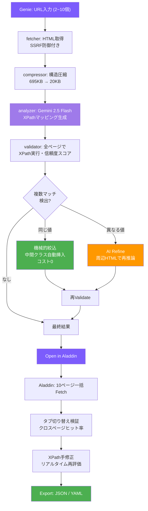

# XPathGenie

> **"Rub the lamp, get the XPath."**
> 「3つの願いはいらない。URLだけくれ。」

URLを入力するだけで、ページから取得可能なデータ要素とXPathマッピングをAIが自動生成するWebアプリ。

## 何ができる？

1. 解析したいページのURLを2〜3個入力
2. AIがページ構造を解析し、取得可能な要素を発見
3. 各要素のXPathと汎用フィールド名を自動生成
4. 複数ページで検証済みの信頼度スコア付き

AIを使うのは**マッピング生成時の1回だけ**。生成されたXPathで以降はAI不要のデータ取得が可能。

## Genie, Aladdin & Jasmine — 3つのツール

### 🧞 XPathGenie（Generate — 生成）

AIがXPathマッピングを自動生成する。2つのモードを持つ：

- **Auto Discover** — URLだけ渡せばAIが全要素を自動発見
- **Want List** — 欲しいフィールドのJSONスキーマを渡して狙い撃ち

### 🪔 XPathAladdin（Analyze — 検証）

Genieが生成したXPathを実ページで検証するリサーチツール。

- **最大10 URLを一括テスト** — 全ページでXPathが通るか確認
- **タブ切り替え** — ページごとの抽出結果を比較
- **クロスページヒット率** — フィールドごとに何ページで値が取れたか表示
- **XPathリアルタイム編集** — その場で修正して即再評価
- **Genieとの連携** — 「Open in Aladdin」ボタンでURL+マッピングを自動引き継ぎ

### 🌸 XPathJasmine（Join — セクション選択）

分析前にメインコンテンツ範囲をインタラクティブに選択するツール。

- **プレビュー＋クリック選択** — fetchしたページをプレビュー表示し、分析対象セクションをクリックで指定
- **Include/Exclude** — メインコンテンツ（緑枠）と除外部分（赤枠）を視覚的に選択
- **選択結果をGenieに引き渡し** — localStorageを通じてシームレスに連携
- **i18n対応** — 日本語/英語UI切り替え
- **クライアントサイドHTML抽出** — 選択範囲のHTMLをブラウザ側で抽出してからAPIに送信

### ワークフロー

```
Jasmine: URL入力 → プレビュー → セクション選択（オプション）
                                        ↓
Genie: URL入力 → AI分析 → XPathマッピング生成 → [Open in Aladdin]
                                                        ↓
Aladdin: 10ページ一括Fetch → XPath検証 → 手修正 → Export (JSON/YAML)
```

localStorage共有でG-A-J間をシームレスに連携。

## 2つのモード（Genie）

### Auto Discover（自動発見）

URLを入れるだけ。AIがページを見て「このサイトからはこれが取れる」と要素を自動発見し、汎用的な英語フィールド名を付与する。

```
入力: URL × 2〜3
出力: {"salary": "//dt[text()='給与']/following-sibling::dd[1]", ...}
```

### Want List（指定モード）

欲しいフィールドのJSONスキーマを渡すと、そのフィールド名に合うXPathを返す。

```json
{
  "facility_name": "勤務先の施設名・会社名",
  "price": "給与・時給・月給",
  "contract": "雇用形態（正社員、契約社員、パート等）",
  "working_hours": ""
}
```

- **値に説明を書く** → AIが意図を正確に理解して最適なXPathを選ぶ
- **値を空にする** → フィールド名から意味を推論してマッピング
- Auto Discoverよりトークン消費が少ない（約30%減）

## 自動精度向上（Refine機能）

XPathGenieは生成後に**自動で精度を上げる**仕組みを持つ。

### 問題: 1つのXPathが複数の要素にマッチする

求人サイトでは同じラベル（「勤務地」「求人ID」等）がヘッダー、詳細セクション、サイドバーなど複数箇所に出現する。単純なXPathだと全箇所にマッチしてしまう。

### 解決: 2段階のRefine

```
AI生成 → Validate → 複数マッチ検出 → Refine → 再Validate
```

#### 同じ値の重複 → 機械的絞り込み（AI不要、コスト0）

求人IDがヘッダー、お気に入りボタン、詳細に3回出る場合：

```
Before: //div[contains(@class,'p-offerContainer')]//div[contains(@class,'c-favoriteBtn')]/@data-job_id
→ 3 matches (same value)

After:  //div[contains(@class,'p-offerContainer')]//div[contains(@class,'p-jobDetail-body')]//div[contains(@class,'c-favoriteBtn')]/@data-job_id
→ 1 match
```

全マッチ要素の祖先チェーンからクラスを探索し、1件に絞れる中間コンテナを自動挿入する。

#### 異なる値の重複 → AIにRefine依頼

詳細の「勤務地」とサイドバーの「おすすめ求人の勤務地」で値が異なる場合、周辺HTML構造をAIに渡して「どちらがメインか」を判断させる。

```
AI: "p-jobDetail-body内の方が詳細情報 → こちらを採用"
→ 中間パスを含むより具体的なXPathを返却
```

### 深さ優先スコアリング

複数マッチの重みづけにはDOM階層の深さも考慮される。浅い要素（ヘッダーのショートカット等）より深い要素（詳細セクション内）が優先される。

```python
score += depth  # 深いほどスコア加算（main/article等の構造シグナルと併用）
```

**設計思想:** 人間がスクレイピングする時と同じ。まずAIが全部やって、判断が必要なところだけ人間がAladdinで確認する。役割が逆転しただけで、ワークフローの構造は同じ。

## 結果の見方

| 項目 | 説明 |
|------|------|
| Field | フィールド名（ダブルクリックでリネーム可） |
| XPath | 生成されたXPath式 |
| Confidence | 信頼度（全URLで値が取れた割合）。100%=全ページで取得成功 |
| Samples | 各URLから実際に取得された値のプレビュー |
| refined バッジ | Refine機能で自動修正されたフィールド |

### 信頼度の読み方

- **100%** — 全ページで値が取れた。安定して使える
- **67%** — 3ページ中2ページで取れた。ページによって存在しない要素の可能性
- **0%** — 値が取れなかった。XPathが不正か、compressorの圧縮で構造が失われた可能性

## エクスポート

結果は3つの方法で利用できる:

### JSON
```json
{
  "facility_name": "//dt[text()='勤務先']/following-sibling::dd[1]",
  "salary": "//dt[text()='給与']/following-sibling::dd[1]"
}
```

### YAML（teddy_crawler互換）
```yaml
mapping:
  facility_name: "//dt[text()='勤務先']/following-sibling::dd[1]"
  salary: "//dt[text()='給与']/following-sibling::dd[1]"
```

### Open in Aladdin
結果をそのままAladdinに引き渡して実ページ検証。

## 使い方のコツ

### 良いURL選びのポイント

- **同じサイトの同じ種類のページ**を2〜3個入れる（詳細ページ同士、一覧ページ同士）
- URLが多いほど検証の信頼度が上がるが、3個あれば十分
- 一覧ページと詳細ページは別々に解析する

### 精度を上げるには

- Want Listモードで値にヒントを書く（例: `"contract": "雇用形態（正社員、パート等）"`）
- 信頼度0%のフィールドがあったら、Auto Discoverで全要素を確認してみる
- フィールド名をダブルクリックしてリネーム → 自分のスキーマに合わせられる
- Jasmineでメインコンテンツを事前選択すると、ノイズの多いサイトでも精度向上

### 注意点

- **SSRサイト（サーバーサイドレンダリング）向け**。SPAサイト（JavaScript動的レンダリング）はHTMLソースに値がないため解析できない
- **AIの解析は完璧ではない**。生成されたXPathは必ず信頼度スコアを確認すること
- **サイト構造が変わるとXPathが壊れる**。定期クロールする場合は定期的に再解析を推奨
- **1回のリクエストで最大10URL**。それ以上はバッチ分割してください
- **Gemini APIのトークンを消費する**。1回あたり約8,000〜18,000トークン（モードとページ構造による）
- **レート制限**: APIは30リクエスト/分のレート制限あり。Origin/Refererチェックによるアクセス制御も実施

## 技術スタック

| 項目 | 技術 |
|------|------|
| Backend | Python / Flask |
| Frontend | Vue 3 (CDN) / Vanilla CSS |
| AI | Gemini 2.5 Flash |
| HTML解析 | lxml |
| テーマ | ダークテーマ + glassmorphism |

## 実績

| サイト | ページ数 | トークン | 所要時間 | フィールド数 | 信頼度100% |
|--------|----------|----------|----------|-------------|-----------|
| ツクイスタッフ | 4 | 15,032 | 27.1秒 | 20 | 20/20 (100%) |
| キャディカル | 3 | 8,749 | 12.3秒 | 23 | 23/23 (100%) |

従来の手作業: **1サイト5〜6時間** × 33サイト = **150〜200時間**
XPathGenie: **1サイト30秒** × 33サイト = **約15分**

## ディレクトリ構成

```
XPathGenie/
├── app.py                  # Flask API サーバー
├── index.html              # Genie フロントエンド
├── aladdin.html            # Aladdin フロントエンド
├── jasmine.html            # Jasmine フロントエンド
├── requirements.txt
├── genie/                  # バックエンドモジュール
│   ├── __init__.py
│   ├── fetcher.py          # HTML取得（SSRF防御）
│   ├── compressor.py       # HTML構造圧縮
│   ├── analyzer.py         # Gemini API呼び出し
│   └── validator.py        # XPath検証・Refine
├── templates/
│   └── index.html          # Flask root route用
├── static/
│   ├── css/
│   ├── js/
│   └── images/
├── wallpapers/             # 壁紙ギャラリーページ
│   ├── index.html
│   └── images/
├── scripts/                # 評価・実験スクリプト
│   ├── evaluate_site.py
│   └── ...
├── docs/
│   ├── whitepaper.md
│   ├── ISSUES.md
│   ├── evaluation/         # 実験レポート・結果
│   └── proposals/          # 設計提案
├── README.md
└── LICENSE
```

## アーキテクチャ



## セットアップ

### 前提条件

- Python 3.9+
- Gemini APIキー（以下いずれかの方法で設定）

### APIキーの設定（BYOK — Bring Your Own Key）

XPathGenieは**BYOK方式**を採用しています。ユーザーが自分のGemini APIキーを持ち込んで利用します。

#### 方法1: Web UIで入力（推奨）

1. [Google AI Studio](https://aistudio.google.com/apikey) でGemini APIキーを取得（無料枠あり）
2. XPathGenieのWeb UIでAPIキー欄に入力
3. 「Remember key」にチェックを入れるとブラウザのlocalStorageに保存（オプション）

詳しくは [Setup Guide](setup-guide.html) を参照。

#### 方法2: サーバーサイド設定（開発・セルフホスト用）

```bash
# APIキーをファイルに配置
mkdir -p ~/.config/google
echo "YOUR_API_KEY" > ~/.config/google/gemini_api_key

# サーバーキーでのフォールバックを許可（環境変数）
export XPATHGENIE_ALLOW_SERVER_KEY=1
```

> ⚠️ 公開サーバーでは `XPATHGENIE_ALLOW_SERVER_KEY` を設定しないでください。全リクエストがサーバーオーナーのAPIキーで課金されます。

> 🔒 **本番環境では必ずHTTPS経由でアクセスしてください。** APIキーがPOSTボディに含まれるため、HTTPではネットワーク上で傍受される可能性があります。

> ⚠️ **リバースプロキシ利用時の注意:** Rate Limiterは `X-Forwarded-For` ヘッダーでクライアントIPを識別します。これは信頼できるリバースプロキシ（Apache, nginx等）の背後でのみ安全です。XPathGenieを直接インターネットに公開する場合、攻撃者がヘッダーを偽装してRate Limitを回避できます。本格的なSaaS化時にはFlaskの [ProxyFix](https://werkzeug.palletsprojects.com/en/latest/middleware/proxy_fix/) ミドルウェアの導入を検討してください。

### インストール

```bash
pip install flask lxml requests
```

### 起動

```bash
python3 app.py
# → http://localhost:8789
```

### systemdサービス（本番環境）

```ini
[Unit]
Description=XPathGenie Flask API
After=network.target

[Service]
Type=simple
User=ec2-user
WorkingDirectory=/path/to/XPathGenie
ExecStart=/usr/bin/python3 -u app.py
Restart=always
RestartSec=3

[Install]
WantedBy=multi-user.target
```

```bash
sudo systemctl enable xpathgenie
sudo systemctl start xpathgenie
```

### Apache連携（リバースプロキシ）

```apache
ProxyPass /xpathgenie/api/ http://127.0.0.1:8789/api/ flushpackets=on timeout=60
ProxyPassReverse /xpathgenie/api/ http://127.0.0.1:8789/api/
```

静的ファイルはApacheのAlias or シンボリックリンクで配信。

## API

### POST /api/analyze

```json
// Request — Auto Discover
{
  "urls": [
    "https://example.com/detail?id=100",
    "https://example.com/detail?id=101"
  ],
  "api_key": "YOUR_GEMINI_API_KEY"
}

// Request — Want List
{
  "urls": [
    "https://example.com/detail?id=100",
    "https://example.com/detail?id=101"
  ],
  "api_key": "YOUR_GEMINI_API_KEY",
  "wantlist": {
    "title": "ページタイトル",
    "price": "価格・料金",
    "location": ""
  }
}

// Response (success)
{
  "status": "ok",
  "site": "example.com",
  "mappings": {
    "title": {
      "xpath": "//h1[contains(@class,'title')]",
      "confidence": 1.0,
      "samples": ["求人タイトルA", "求人タイトルB"],
      "optional": false
    }
  },
  "pages_analyzed": 2,
  "pages_failed": 0,
  "tokens_used": 8749,
  "elapsed_seconds": 12.3,
  "refined_fields": ["original_id"],
  "diagnostics": {
    "compressed_size_bytes": 15234
  }
}

// Response (error)
{
  "status": "error",
  "reason": "fetch_failed",
  "message": "Failed to fetch all URLs",
  "suggestion": "Check if the site requires JavaScript rendering (SPA).",
  "diagnostics": {}
}
```

### GET /api/fetch?url=...

Aladdin用のサーバーサイドHTMLフェッチ（CORS回避）。

```json
// Response
{
  "html": "<html>...",
  "url": "https://example.com/page"
}
```

## おまけ

- **Wallpapers** — XPathGenieテーマの壁紙ギャラリー (`/wallpapers/`)

## ホワイトペーパー

技術的な詳細は [Technical Whitepaper](docs/whitepaper.md) を参照。

## ライセンス

MIT License — see [LICENSE](LICENSE)

## Author

goodsun
