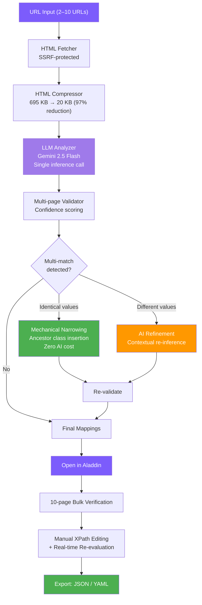
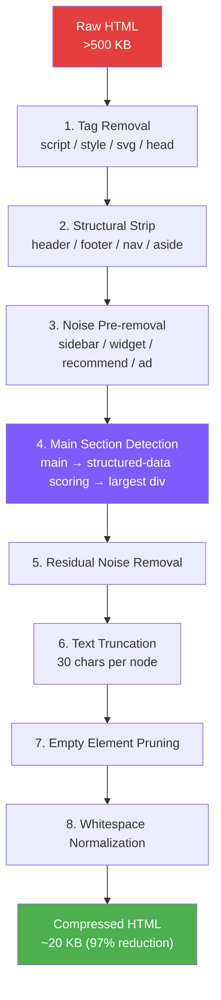
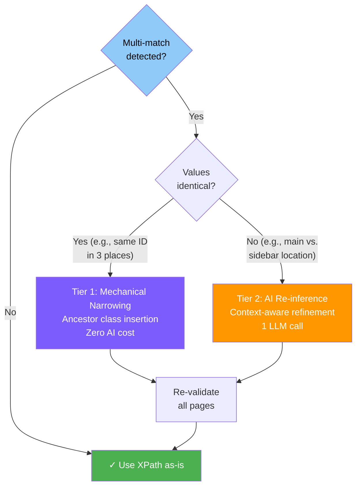
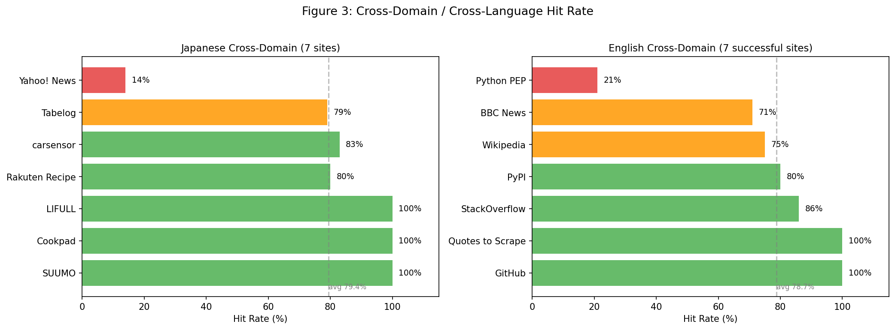
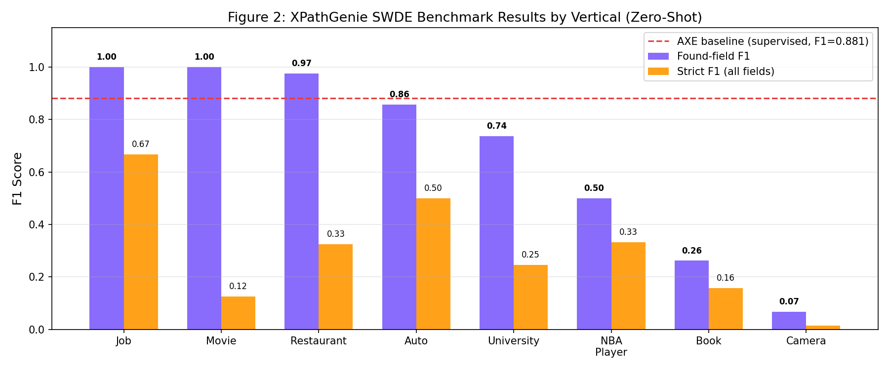
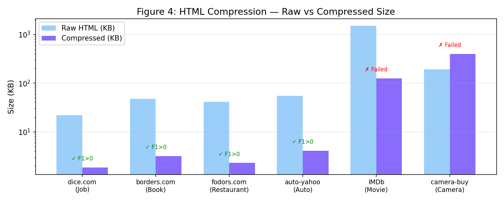
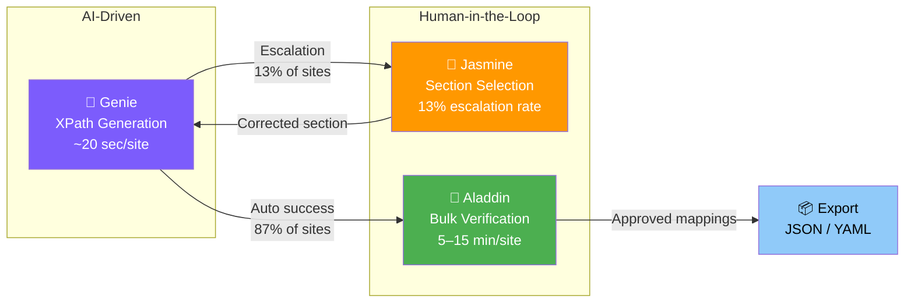

# XPathGenie: LLM-Driven Automated XPath Generation with Multi-Page Validation and Two-Tier Refinement

## Abstract

We present XPathGenie, a system that automates XPath mapping generation from raw URLs using HTML structural compression (~97% reduction), LLM-based inference, multi-page validation, and two-tier refinement. Unlike per-page LLM extraction systems, XPathGenie invokes AI once to generate reusable XPath expressions, ensuring zero marginal AI cost per page. Evaluation across 23 medical job-listing websites achieved 85.1–87.3% field-level hit rate—deliberately measuring structural extraction stability rather than semantic accuracy, as the goal is reusable XPath generation rather than value extraction benchmarking—with 11 sites at 100%; supplementary cross-domain evaluation on 10 sites across 5 non-medical domains (e-commerce, real estate, recipe, restaurant reviews, news) achieved a macro-average hit rate of 79.4%, confirming domain generalizability. An additional English-language evaluation on 10 sites (3 pages each) across 10 domains achieved a macro-average hit rate of 78.7% among successful sites (7/10), with GitHub and Quotes to Scrape reaching 100%, providing preliminary evidence of cross-linguistic applicability. Core-field analysis reveals that schema-guided extraction primarily expands coverage (+13.1pp) over open-ended discovery. A zero-shot evaluation on a subset of the SWDE benchmark (22 sites, 8 verticals, 220 pages) achieved F1 = 0.689 on fields where XPaths were successfully generated, with 60% of detected fields at perfect F1 = 1.0; automated semantic classification on 400 SWDE field-value pairs yielded 78.0% semantic accuracy, complementing the 95.0% from manual evaluation on production sites. The primary bottleneck is field discovery coverage (46%) rather than extraction accuracy, contrasting with supervised systems like AXE (F1 88.1%) that benefit from labeled training data. We identify the compression-generation gap—a mismatch between compressed and raw HTML whitespace—resolved via `normalize-space()` predicates.

## 1. Introduction

Structured data extraction from websites is fundamental to competitive intelligence, job aggregation, price monitoring, and numerous data-driven applications. At the core of most extraction pipelines lies XPath—a query language for selecting nodes from HTML/XML documents. Despite its power, XPath authoring remains a predominantly manual craft.

The challenges are threefold. First, **time cost**: constructing a reliable XPath mapping for a single website typically requires several hours of expert effort, involving page inspection, expression writing, edge-case handling, and cross-page validation. For organizations managing portfolios of dozens of target sites, this translates to hundreds of hours of specialized labor. Second, **tacit knowledge dependency**: effective XPath construction requires understanding of common HTML patterns (definition lists, table layouts, nested containers), site-specific idiosyncrasies, and the distinction between main content and peripheral elements such as sidebars and recommendation widgets. This knowledge is difficult to systematize. Third, **scalability**: as target sites evolve their HTML structures, previously valid XPaths break, necessitating ongoing maintenance that scales linearly with portfolio size.

This work does not attempt to eliminate human judgment, but to reposition it as a sparse and structured intervention within an otherwise automated pipeline. XPathGenie addresses these challenges by reformulating XPath generation as an LLM inference problem operating on structurally compressed HTML, augmented by deterministic validation and refinement stages. The key insight is that AI should be invoked exactly once—for initial mapping discovery—while all subsequent operations (validation, mechanical refinement, ongoing extraction) operate purely on DOM manipulation at zero marginal AI cost. Our evaluation measures structural extraction stability (whether XPaths consistently return non-empty values across pages) rather than semantic correctness against ground-truth labels; human verification via the companion tool Aladdin is recommended for production deployment.

This paper makes three primary contributions:

1. **A zero-marginal-cost XPath generation pipeline** combining HTML structural compression (~97% token reduction), LLM-based inference, multi-page validation, and two-tier refinement (mechanical narrowing at zero AI cost + targeted AI re-inference). The system invokes AI once per site; all subsequent extraction is purely deterministic.
2. **An escalation-based human-in-the-loop architecture** (Genie–Jasmine–Aladdin) that distributes cognitive labor between AI and humans: automated generation handles 87% of sites, while the interactive Jasmine tool provides a single-click escalation path for the remaining 13%, and Aladdin enables bulk verification.
3. **Multi-faceted evaluation spanning 62 websites across 2 languages, 15+ domains, and 3 evaluation paradigms**: structural stability (hit rate 85–87% on 23 production sites), semantic accuracy (95.0% on 100 manually judged samples), and ground-truth F1 (0.689 on 22 SWDE benchmark sites in a zero-shot setting), establishing both practical reliability and comparability with supervised baselines.

Additionally, we identify the **compression-generation gap** — a systematic mismatch between whitespace-normalized compressed HTML and raw-HTML execution contexts — and its resolution via `normalize-space()` predicates.

## 2. Related Work

Automated web data extraction has been studied extensively, yielding several families of approaches. We organize prior work into five categories.

### 2.1 Visual Scraping and CSS Selector Tools

**Visual scraping tools** (e.g., Octoparse, ParseHub, Import.io) provide point-and-click interfaces where users visually select elements. While reducing the need for XPath syntax knowledge, these tools still require manual element selection per field and per site, offering no automation of the mapping discovery itself. **CSS selector generators** (e.g., SelectorGadget, browser DevTools) automatically suggest selectors for clicked elements but operate on single elements and single pages, lacking cross-page generalization and batch field discovery.

### 2.2 Wrapper Induction

Wrapper induction systems learn extraction rules from labeled examples. Early work by Kushmerick et al. (1997) and Dalvi et al. (2011) established the paradigm of learning extraction patterns from annotated page sets. More recently, commercial systems such as **Diffbot** (Tong, 2014) and **Zyte Automatic Extraction** (formerly AutoExtract) apply machine learning to extract structured data from web pages without explicit rule authoring. These systems achieve strong results on common page types (articles, products) but rely on pre-trained models for specific verticals and may struggle with niche or unconventional layouts.

### 2.3 HTML-Aware Language Models

A family of language models has been developed specifically for understanding HTML/DOM structure. **MarkupLM** (Li et al., 2022) extends pre-trained language models with XPath-based position embeddings, enabling tasks such as web page classification and information extraction from semi-structured documents. **WebFormer** (Wang et al., 2022) proposes a Transformer architecture that models the relationship between HTML tokens and DOM structure for web page understanding. **DOM-LM** (Deng et al., 2022) pre-trains on DOM trees with structure-aware objectives. These models demonstrate that encoding HTML structure explicitly improves downstream extraction tasks, but they typically require fine-tuning on labeled data for each target schema.

### 2.4 LLM-Based Web Extraction

The emergence of large language models has enabled new approaches to web data extraction. **ScrapeGraphAI** (Perini et al., 2024) orchestrates LLM calls via a graph-based pipeline to extract structured data from web pages, supporting multiple LLM backends. However, ScrapeGraphAI invokes the LLM at extraction time for each page, meaning AI cost scales linearly with the number of pages processed. In contrast, XPathGenie uses the LLM solely to generate reusable XPath expressions, incurring AI cost only once per site mapping.

**Zero-shot extraction** approaches apply LLMs to extract structured data without task-specific training. Lockard et al. (2020) demonstrated zero-shot closed information extraction from semi-structured web pages (ZeroShotCeres). More recent work has explored using LLMs to generate CSS selectors or XPath expressions from natural-language descriptions of desired fields (Gur et al., 2023; Zhou et al., 2024), though these typically operate on single pages without cross-page validation.

Open-source crawling frameworks such as **FireCrawl** (2024) and **crawl4ai** (2024) convert web pages to LLM-friendly formats (Markdown, structured text) for downstream extraction. These tools focus on content conversion rather than reusable selector generation, and they invoke LLMs per page during extraction.

More recently, several systems have specifically targeted LLM-driven XPath generation. **XPath Agent** (arXiv:2502.15688, 2024) employs a two-stage approach where a lightweight LLM extracts candidate elements and a stronger LLM constructs XPath expressions from multiple sample pages and natural-language queries. **Automatic XPath generation for vertical websites** (Huang & Song, 2025, *Journal of King Saud University*) decomposes XPath generation into multi-task sub-problems, learning robust expressions from seed pages for vertical domains. **AXE (Adaptive X-Path Extractor)** (arXiv:2602.01838, 2026) applies aggressive DOM pruning achieving 97.9% token reduction, enabling a 0.6B parameter model to achieve F1 88.1% on the SWDE benchmark with Grounded XPath Resolution (GXR) for traceable extraction. These systems represent the closest related work to XPathGenie, and we discuss key differentiators in Section 2.6.

### 2.5 Boilerplate Detection and Content Extraction

Content extraction from web pages has a long history. Kohlschütter et al. (2010) proposed boilerplate detection using shallow text features, achieving effective separation of main content from peripheral elements. XPathGenie's HTML compression pipeline (Section 3.1) draws on similar intuitions—identifying and removing non-content elements—but operates at the DOM structural level to preserve the hierarchy needed for XPath construction.

### 2.6 Positioning

XPathGenie differs from all prior approaches in a critical architectural decision: the LLM generates *reusable XPath expressions*, not extracted data. This means AI cost is incurred once at mapping time, and all subsequent extractions are pure DOM queries—deterministic, fast, and free. The HTML compression pipeline further distinguishes our approach by enabling LLM analysis within practical token budgets. Unlike HTML-aware language models that require fine-tuning, XPathGenie leverages general-purpose LLMs with carefully engineered prompts. Unlike wrapper induction, it requires no labeled training data—only a small set of example URLs.

Compared to the most recent LLM-based XPath systems, XPathGenie's key differentiators are: (1) **zero post-generation AI cost** — XPath Agent and AXE may invoke LLMs during extraction or agent execution, while XPathGenie's output is purely deterministic `lxml.xpath()` calls; (2) **multi-page cross-validation with two-tier refinement** — mechanical narrowing resolves identical-value multi-matches at zero cost, with AI re-inference reserved for genuinely ambiguous cases, a mechanism absent in prior systems; (3) **different evaluation paradigms** — AXE operates in a supervised setting, reporting F1 88.1% against ground-truth labels on the SWDE benchmark, while XPathGenie operates in a zero-shot setting with no labeled training data; a direct SWDE evaluation (Section 4.14) shows XPathGenie achieves F1 = 0.689 on successfully detected fields (strict F1 = 0.317 including undetected fields), with the gap primarily attributable to field discovery coverage rather than extraction accuracy; and (4) **structure-preserving compression** — unlike AXE's aggressive node pruning, XPathGenie's compression retains DOM hierarchy needed for XPath construction, trading off CSS-framework compatibility for structural fidelity.

## 3. System Architecture

XPathGenie implements a six-stage pipeline from URL input to validated XPath mappings, followed by an optional human-in-the-loop verification stage via the companion tool Aladdin.



### 3.1 HTML Compression

Raw HTML pages from modern websites routinely exceed 500 KB, far exceeding practical LLM context windows when multiple pages must be analyzed simultaneously. The compression module (`genie/compressor.py`) applies a multi-pass structural reduction:

1. **Tag removal**: Elements with no extractable content are eliminated entirely: `script`, `style`, `noscript`, `iframe`, `svg`, `link`, `meta`, and `head`.

2. **Structural strip**: Layout-only containers (`header`, `footer`, `nav`, `aside`) are removed, as they rarely contain target data fields.

3. **Noise pre-removal**: Before main section detection, all subtrees matching noise patterns are removed from the document. This prevents non-content regions (e.g., privacy policy sections containing `<th>`/`<dt>` elements) from skewing the main section detection algorithm. Noise patterns match class or ID attributes against: `recommend|related|sidebar|widget|breadcrumb|modal|slide|footer|banner|ad[-_]|popup|cookie|privacy|policy|inquiry|contact|sns[-_]|share`.

4. **Main section detection**: The algorithm locates the primary content region through a three-tier fallback: (a) explicit semantic elements (`<main>`, `<article>`), (b) **structured data detection**—scoring candidate containers by the product of structured marker count (number of `<th>` and `<dt>` descendants) and text content length, which reliably identifies data-rich regions while avoiding small summary sections, and (c) the `<div>` or `<section>` with the most text content. When no single container is dominant (i.e., the top candidate holds less than 50% of the total score), multiple qualifying sections are merged into a virtual wrapper element. The `<body>` element is explicitly excluded from candidates to prevent overly broad selection. This multi-signal scoring was refined after evaluation revealed that simple marker counting could select small "checkpoint" sections over larger content areas.

5. **Residual noise removal**: Within the identified main section, any remaining child subtrees matching noise patterns are recursively removed.

6. **Text truncation**: All text nodes are truncated to 30 characters, preserving structural labels (e.g., `給与`, `勤務地`) while eliminating lengthy content that consumes tokens without aiding XPath generation.

7. **Empty element pruning**: Elements with no text content and no children are removed (excluding self-closing tags like `br`, `hr`, `img`, `input`).

8. **Whitespace normalization**: Redundant whitespace is collapsed, and inter-tag whitespace is eliminated.

The result is a structural skeleton that preserves the DOM hierarchy, class names, and label text essential for XPath construction while achieving approximately 97% size reduction (e.g., 695 KB → 20 KB). Each compressed page is further capped at 8,000 characters before being sent to the LLM.



### 3.2 LLM-Based XPath Generation

The system offers two inference modes, both implemented as single-call prompts to Gemini 2.5 Flash with `temperature=0.1` for near-deterministic output and `responseMimeType=application/json` for structured responses.

**Auto Discover mode** sends compressed HTML samples with instructions to identify all meaningful data fields and return a JSON mapping of field names to XPath expressions. The prompt enforces constraints critical for downstream reliability:

- XPaths must use the `//` prefix and select element nodes (not `text()` nodes)
- Class matching must use `contains(@class, ...)` to handle multi-class attributes
- Text matching must use `normalize-space()` to handle whitespace differences between compressed and raw HTML (e.g., `//dt[normalize-space()='給与']` instead of `//dt[text()='給与']`)
- XPath functions beyond `contains()` and `normalize-space()` are prohibited (no `substring-after`)
- Output is limited to the 20 most important fields
- Field names must be lowercase English and semantically generic

**Want List mode** accepts a user-provided JSON schema where keys are desired field names and values are natural-language descriptions of the intended data. For example: `{"contract": "雇用形態 (employment type: 正社員/full-time, 契約社員/contract, パート/part-time, etc.)"}`. The LLM matches fields by *meaning* rather than literal label text, enabling cross-language semantic matching. This mode consumes approximately 30% fewer tokens than Auto Discover.

After LLM response, the system performs **automatic root prefixing**: the first compressed HTML's root element is inspected for a meaningful class name, which is prepended to all generated XPaths as a scoping container. This ensures XPaths are anchored to the main content region.

### 3.3 Multi-Page Validation

Generated XPaths are evaluated against the original (uncompressed) HTML of every fetched page. For each field, the validator computes:

- **Confidence score**: The fraction of pages where the XPath returns at least one non-empty result. A score of 1.0 indicates the XPath works across all analyzed pages. Note that this metric measures *extraction coverage*, not accuracy against ground-truth labels; the system does not compare extracted values to a gold standard.
- **Sample values**: The first 100 characters of extracted text from each page, enabling quick human inspection.
- **Multi-match warnings**: Fields where an XPath matches more than one DOM node on any page are flagged for refinement.

When multiple nodes match a single XPath, the validator selects the best match using the depth-weighted content scoring algorithm (Section 3.5).

### 3.4 Two-Tier Refinement

Job listing sites and similar structured-content websites frequently repeat labels across sections—a field labeled "勤務地" (work location) may appear in the main detail area, a sidebar summary, and a related-jobs widget. A single `//dt[normalize-space()='勤務地']/following-sibling::dd[1]` XPath will match all occurrences.

XPathGenie's refinement mechanism addresses this through a two-tier strategy:

**Tier 1: Mechanical narrowing (zero AI cost).** When all matched values are identical (e.g., the same job ID appearing in three places), the system performs deterministic DOM analysis. For each matched element, it traverses the ancestor chain looking for elements with class attributes. It then constructs candidate XPaths by inserting intermediate container selectors (e.g., `//div[contains(@class,'p-jobDetail-body')]`) between the root container and the core expression. The first candidate that produces exactly one match is adopted. This operation requires no LLM call and adds negligible computation.

**Design note on `narrow_by_first_match`:** The mechanical narrowing algorithm validates candidate XPaths against only the first page in the input set. This is a deliberate trade-off for performance—checking all pages for every candidate would be prohibitively slow. The subsequent re-validation stage (which runs against all pages) catches any narrowing that fails to generalize.

```
Before: //div[contains(@class,'p-offerContainer')]//div[contains(@class,'c-favoriteBtn')]/@data-job_id
→ 3 matches (identical value)

After:  //div[contains(@class,'p-offerContainer')]//div[contains(@class,'p-jobDetail-body')]//div[contains(@class,'c-favoriteBtn')]/@data-job_id
→ 1 match
```

**Tier 2: AI re-inference (contextual refinement).** When matched values differ (e.g., the main job's location vs. a recommended job's location), mechanical narrowing cannot determine which match is correct. In this case, the system sends the surrounding HTML context (up to 1,500 characters per match, maximum 4 matches) back to the LLM with a refinement prompt. The prompt instructs the model to identify the *primary* match—typically the most detailed content in the main job-detail section—and return a more specific XPath.

The refinement prompt explicitly guides the LLM to look for intermediate structural containers with meaningful class names, producing XPaths that are specific enough for single-match accuracy while remaining readable and maintainable.

After refinement, all mappings are re-validated to confirm that the refined XPaths maintain cross-page accuracy.



### 3.5 Depth-Weighted Content Scoring

When an XPath matches multiple nodes and a single "best" value must be selected for the sample display, the validator employs a content scoring algorithm that combines structural signals with DOM depth:

```python
score = 0
for ancestor in node.ancestors():
    if ancestor.tag in ('main', 'article'):
        score += 20
    elif ancestor.tag in ('aside', 'nav', 'footer'):
        score -= 20
    if class/id contains MAIN_SIGNALS ('detail', 'content', 'primary', ...):
        score += 10
    if class/id contains SIDE_SIGNALS ('sidebar', 'recommend', 'related', ...):
        score -= 10
score += depth  # deeper nesting = more specific context
```

The depth component reflects a key observation: in typical website layouts, the primary content area involves deeper nesting than peripheral elements like header shortcuts or sidebar summaries. Combined with semantic signals from tag names and class names, this heuristic reliably identifies the main-content instance among duplicates.

### 3.6 Human-in-the-Loop Verification (Aladdin)

While XPathGenie automates mapping generation, production deployment benefits from human verification. The companion tool **XPathAladdin** provides:

- **10-page bulk testing**: Users can input up to 10 URLs from the same site type, and Aladdin fetches all pages and evaluates every XPath against each.
- **Tab-based comparison**: Results are presented in a tabbed interface, allowing page-by-page inspection of extracted values.
- **Cross-page hit rate**: For each field, Aladdin displays how many pages returned a value, immediately surfacing page-specific elements.
- **Real-time XPath editing**: Users can modify XPaths directly in the interface, with immediate re-evaluation against all loaded pages.
- **Seamless handoff**: A single "Open in Aladdin" button in XPathGenie transfers all URLs and generated mappings via localStorage, requiring no manual data entry.
- **Export**: Verified mappings can be exported as JSON or YAML (compatible with the teddy_crawler extraction framework).

This architecture embodies a deliberate role reversal: traditionally, humans write XPaths and machines validate them; in XPathGenie's workflow, machines write XPaths and humans validate them.

### 3.7 Interactive Section Selection (Jasmine)

While the noise pattern system (Section 3.1) handles common cases of irrelevant content, the compression-generation gap remains fundamentally a *selection problem*: which part of the page should the LLM see? Rule-based approaches are inherently limited—they cannot anticipate every site's structural idiosyncrasies. The companion tool **XPath Jasmine** addresses this gap through interactive, human-guided section selection.

#### 3.7.1 Problem: The Limits of Rule-Based Abstraction

The HTML compressor's noise pattern mechanism (removing navigation, footers, sidebars, forms) is an attempt to replicate human "selective attention"—the ability to look at a complex page and instantly focus on the relevant data table while ignoring everything else. However, human abstraction operates on semantic understanding, while rule-based pattern matching operates on syntactic cues (class names, tag structures). When these cues are absent or misleading, the compressor selects the wrong content section.

A concrete example: on yakuzaishisyusyoku.net, an application form (`div.entry_box`) contained a table with more `<th>`/`<td>` pairs than the actual job detail table. The compressor's depth-weighted content scoring selected the form as the "main content" because it had a higher structural score—producing zero useful field mappings. The fix required adding a new noise pattern (`entry_box|entry_form|apply_|registration`), but this is reactive: each new failure mode demands a new rule.

#### 3.7.2 Approach: Blackout Preview

Jasmine renders the target page in an iframe and allows users to interactively select which section the LLM should analyze:

1. **Click to include (green)**: User clicks any element to select it as the analysis target. The selected element is highlighted with a green outline.
2. **Shift+click to exclude (red)**: Within the selected section, users can further exclude sub-sections (e.g., an embedded form within a job detail container).
3. **Blackout visualization**: All content *outside* the selected section is dimmed (opacity: 0.15, grayscale, brightness: 0.3), providing an immediate visual preview of exactly what the LLM will see. This makes the compression boundary visible and tangible.
4. **Parent path navigation**: The CSS selector path (e.g., `#result > div.detail_box > table`) is displayed with each ancestor element clickable, allowing users to broaden the selection scope by clicking a parent element.

This interaction model externalizes the compressor's most critical decision—section selection—to the user, who possesses the semantic understanding that rule-based systems lack. The user sees the page as a human reader would, and directly indicates "analyze this, ignore that."

#### 3.7.3 Escalation Model

Jasmine supports three operational modes that balance automation and human oversight:

- **auto**: Fully automatic section selection using the existing compressor heuristics plus automatic retry. If the initial analysis returns zero fields, the system selects the next-highest-scoring section and retries. Suitable for batch/API workflows.
- **confirm**: The compressor's selection is presented as a blackout preview for user confirmation before LLM analysis begins. Suitable for interactive use where users want visibility into what the LLM sees.
- **auto+escalate**: Default automatic mode, but failures trigger an interactive preview where the user manually selects the correct section. This is the recommended mode for SaaS deployment—it minimizes friction for well-structured sites while gracefully handling edge cases.

#### 3.7.4 Pipeline Integration: Generate → Join → Analyze

Jasmine integrates with the existing tools through localStorage-based state sharing, establishing a three-stage pipeline where each tool's name reflects its function:

| Tool | Function | Role |
|------|----------|------|
| **Genie** (Generate) | LLM-based XPath generation | Generates field→XPath mappings from compressed HTML |
| **Jasmine** (Join) | Interactive section selection | Joins user intent with page structure; controls what Genie sees |
| **Aladdin** (Analyze) | Multi-page validation | Analyzes mapping quality across multiple pages |

The workflow proceeds as follows:

1. **Want List** (shared via localStorage): User defines desired fields with example values (e.g., `{"job_title": "薬剤師", "salary": "年収500万円"}`).
2. **Jasmine**: User loads the target URL, selects the relevant section via blackout preview, and triggers analysis. Jasmine sends the selected section (with exclusions) to the Genie API endpoint.
3. **Results**: Extracted values (not XPath expressions) are displayed inline, with multi-match warnings highlighted in orange. The underlying XPath mappings are stored to localStorage.
4. **Handoff to Aladdin**: A single click navigates to Aladdin, which automatically loads the URL and mappings from localStorage for multi-page validation.

This pipeline embodies the principle that **the most valuable human contribution is not writing code, but directing attention**. The user's only task is pointing at the right part of the page—everything else (compression, LLM inference, validation, refinement) is automated.

#### 3.7.5 Design Philosophy: Where NOT to Use AI

Jasmine's design reflects a deliberate architectural decision about the boundary between AI and human cognition:

- **AI is optimal for**: Pattern recognition across HTML structures, generating syntactically correct XPath expressions, systematic validation across multiple pages.
- **Humans are optimal for**: Semantic understanding of page layout, distinguishing "job details" from "application form" at a glance, deciding what information is relevant.

The compressor's noise patterns attempt to encode human-like semantic judgment into rules, but this is fundamentally a *knowledge representation problem*—there will always be sites whose structure doesn't match the rules. Jasmine acknowledges this limitation and provides an escape hatch: when rules fail, a human can intervene with a single click, and the rest of the pipeline proceeds automatically.

This "AI for generation, human for selection" division mirrors the broader role reversal described in Section 5.2: just as humans verify XPaths rather than writing them, humans select content sections rather than implementing selection rules. In both cases, the human task is shifted from *construction* (writing XPaths, writing rules) to *recognition* (verifying values, recognizing relevant content)—a cognitive task humans perform effortlessly.

#### 3.7.6 Empirical Validation

To quantify the impact of interactive section selection, we measured the escalation rate and hit rate improvement across the 23-site evaluation corpus.

**Escalation rate.** Using automatic section selection (compressor heuristics only), 3 of 23 sites (13%) produced hit rates below 50%, representing the upper bound of sites requiring human intervention via Jasmine:

| Site | Auto Hit Rate | Failure Mode |
|------|--------------|-------------|
| yakuzaishisyusyoku | 0.0% (2 fields detected, both 0%) | Application form selected over job detail table |
| cocofump | 20.0% (1/5 fields) | Non-standard div/span layout |
| phget | 20.0% (1/5 fields) | Non-standard div/span layout |

The remaining 20 sites (87%) achieved hit rates above 66% with fully automatic processing, requiring no human intervention. This confirms that the auto+escalate mode would minimize friction: the vast majority of sites process automatically, with Jasmine intervention needed only for the ~13% of sites where heuristic section selection fails.

**Case study: yakuzaishisyusyoku (0% → 100%).** This site represents the clearest demonstration of Jasmine's value. In automatic mode, the compressor's depth-weighted content scoring selected an application form (`div.entry_box`) over the job detail table (`div.detail_box`), because the form contained more `<th>`/`<td>` pairs. The result: only 2 fields detected, both at 0% hit rate.

With Jasmine-equivalent section selection (specifying `div.detail_box` as the analysis target), the system produced:

| Condition | Fields Detected | Avg Hit Rate | Fields at 100% |
|-----------|----------------|-------------|-----------------|
| Auto (before noise fix) | 2 | 0.0% | 0 |
| Auto (after noise pattern fix) | 20 | 95.0% | 18/20 |
| Jasmine (selector: `div.detail_box`) | 20 | **100.0%** | 20/20 |

The noise pattern fix (adding `entry_box|entry_form` to exclusion rules) recovered most of the performance automatically, but Jasmine's explicit section selection achieved perfect results—confirming that human semantic judgment, when available, outperforms even well-tuned heuristics.

**Implications for the escalation model.** The 13% escalation rate validates the auto+escalate design: for a portfolio of 100 sites, approximately 87 would process fully automatically, with only ~13 requiring a single human interaction (clicking the correct content section in Jasmine's blackout preview). At an estimated 30 seconds per Jasmine interaction, the total human effort for the escalated sites would be approximately 6.5 minutes—negligible compared to the hours saved by automatic processing of the remaining sites.

#### 3.7.7 Semantic Accuracy Validation

While the primary evaluation metric (hit rate) measures structural extraction stability—whether XPaths return non-empty values—it does not assess whether the *correct* value is extracted for the intended field. To address this limitation, we conducted a semantic accuracy evaluation on a random sample of 100 field-value pairs drawn from the 23-site Want List evaluation corpus (350 total fields with non-empty extractions, sampled with seed=42).

Each pair was manually judged against three criteria:

| Judgment | Definition | Count |
|----------|-----------|-------|
| ✅ Correct | Extracted value is semantically appropriate for the field name | 82 |
| ⚠️ Partial | Contains the correct information but with additional noise (e.g., license field includes both license name *and* experience requirements from the same DOM node) | 13 |
| ❌ Wrong | Extracted value is incorrect for the field name | 5 |

**Semantic accuracy (Correct + Partial): 95.0%.** Strict accuracy (Correct only): 82.0%.

The 5 incorrect cases fall into three categories:

1. **Label-as-value extraction** (1 case): The XPath captured the field label text ("勤務地") instead of the actual city name, due to ambiguous DOM structure where the label and value shared the same parent element.
2. **Adjacent section leakage** (2 cases): The XPath captured content from a neighboring section (e.g., holiday field containing salary/bonus information from a combined data block).
3. **Field confusion** (2 cases): Semantically similar fields (e.g., `price_rule` vs `welfare_program`) mapped to the wrong content when the site used a single container for both salary and benefits information.

The 13 partial cases predominantly exhibit a "correct value + noise" pattern (e.g., `license` field containing both the required license name and experience requirements), which is amenable to post-processing cleanup.

These results confirm that XPathGenie's structural hit rate (87.3%) translates to high semantic accuracy (95.0%) in practice: the vast majority of non-empty extractions contain the intended information. The 5% error rate is concentrated in structurally ambiguous cases where field boundaries are unclear even to human readers, suggesting that the remaining errors reflect genuine page structure ambiguity rather than systematic XPath generation failures.

**Effective accuracy.** Combining the two metrics provides a more complete picture of end-to-end system performance: hit rate (87.3%) × semantic accuracy (95.0%) = **82.9% effective accuracy**—the probability that a given field on a given page yields a semantically correct extraction. This integrated metric accounts for both structural extraction failures (XPath returns empty) and semantic extraction errors (XPath returns the wrong value), and represents the true yield a downstream consumer can expect before human verification.

## 4. Evaluation

### 4.1 Experimental Setup

XPathGenie was evaluated on a portfolio of 35 Japanese medical/healthcare job-listing websites spanning pharmacist, nursing, caregiving, and general medical domains. Of the 35 sites, 23 had SSR (server-side rendered) detail pages accessible via standard HTTP requests. The remaining 12 were excluded: 7 required JavaScript rendering (SPA), 3 returned HTTP errors (403/500) or required authentication, and 2 had other access issues. Additionally, a cross-domain evaluation was conducted on 10 websites across 5 non-medical domains (e-commerce, real estate, recipe/UGC, restaurant reviews, news) to assess generalizability beyond the medical job-listing domain (Section 4.12), an English-language cross-domain evaluation on 10 sites across 10 domains (3 pages each, 30 pages total) to assess multi-language generalizability (Section 4.13), and a SWDE benchmark evaluation on 22 sites across 8 verticals (10 pages each, 220 pages total) to enable direct F1 comparison with supervised baselines (Section 4.14).

Each site was analyzed using a single detail-page URL, and the generated XPath mappings were cross-validated against 10 detail pages from the same site. All evaluation results reported in this paper are from a single experimental run conducted on February 17, 2026, using Gemini 2.5 Flash with `temperature=0.1`. Raw results for each site and mode are archived in `docs/evaluation/results/` with filenames encoding site number, name, and evaluation mode. Note that field counts differ between Auto Discover and Want List modes because each mode generates a different set of field mappings; earlier evaluation runs (documented in `EVALUATION_REPORT.md`) used different configurations and should not be compared directly with the tables below.

**Evaluation metrics.** We report three levels of evaluation:

1. **Field-level hit rate**: The fraction of pages on which a generated XPath returns at least one non-empty result. This measures extraction coverage per field, not semantic accuracy against ground-truth annotations.
2. **Site-level average hit rate**: The mean of field-level hit rates for a given site.
3. **Core field hit rate**: Hit rate computed only on 7 "core fields" that are universally present on job-listing sites: salary (price), work location (address), employment type (contract), occupation, facility name, working hours, and holidays. This metric reflects practical utility—whether the most important data can be extracted.

Two evaluation conditions were tested:

- **Auto Discover mode**: No schema guidance; the LLM autonomously identifies fields and generates XPaths.
- **Want List mode**: A unified schema of 30 field definitions (e.g., `"contract": "雇用形態（正社員、契約社員、パート等）"`, `"facility_name": "勤務先の施設名・会社名"`) is provided, guiding the LLM on what to extract.

### 4.2 Results: Auto Discover Mode

| # | Site | Domain | Structure | Fields | Perfect | Hit Rate |
|---|------|--------|-----------|--------|---------|----------|
| 2 | selva-i | Pharma | dt/dd | 20 | 20/20 | **100.0%** |
| 4 | yakumatch | Pharma | th/td | 20 | 20/20 | **100.0%** |
| 9 | oshigoto-lab | Medical | dt/dd+th/td | 12 | 12/12 | **100.0%** |
| 12 | bestcareer | Pharma | th/td (Shift-JIS) | 20 | 20/20 | **100.0%** |
| 13 | pharmapremium | Pharma | th/td | 14 | 14/14 | **100.0%** |
| 18 | nikken-care | Care | dt/dd | 10 | 10/10 | **100.0%** |
| 19 | nikken-nurse | Nurse | dt/dd | 10 | 10/10 | **100.0%** |
| 21 | MRT-nurse | Nurse | div/span | 6 | 6/6 | **100.0%** |
| 24 | kaigo-work | Care | th/td | 14 | 14/14 | **100.0%** |
| 25 | w-medical-9 | Medical | th/td | 19 | 19/19 | **100.0%** |
| 26 | firstnavi | Nurse | th/td | 19 | 19/19 | **100.0%** |
| 5 | mynavi | Pharma | dt/dd | 20 | 19/20 | 98.0% |
| 16 | pharmalink | Pharma | th/td | 20 | 17/20 | 98.5% |
| 32 | yakusta | Pharma | dt/dd+th/td | 18 | 17/18 | 98.3% |
| 31 | ph-10 | Pharma | th/td | 15 | 11/15 | 96.7% |
| 35 | kaigokango | Care/Nurse | th/td | 18 | 17/18 | 95.6% |
| 30 | mc-pharma | Pharma | th/td (Shift-JIS) | 15 | 12/15 | 92.7% |
| 20 | cocofump | Care | dt/dd+th/td | 6 | 5/6 | 91.7% |
| 14 | caresta | Care | th/td | 17 | 12/17 | 85.9% |
| 1 | tsukui-staff | Care | dt/dd | 20 | 13/20 | 83.0% |
| 8 | apuro | Pharma | dt/dd+th/td | 13 | 9/13 | 73.1% |
| 6 | phget | Pharma | th/td | 9 | 1/9 | 11.1% |
| 10 | yakuzaishisyusyoku | Pharma | th/td | 15 | 1/15 | 6.7% |

**Note:** All results were obtained after system improvements including encoding auto-detection (Shift-JIS/EUC-JP), XML declaration stripping, structured-data-aware main section detection, noise pattern expansion (privacy policy, contact forms), pre-detection noise removal, and `normalize-space()` adoption in LLM prompts for whitespace-resilient XPath generation. These engineering fixes are prerequisites for correct HTML processing.

**Summary (Auto Discover, 23 sites):** Field-level: 298/350 perfect fields (**85.1%**). 11 sites achieved 100%. Core field hit rate: **96.0%** (96/100 core fields found were perfect).

### 4.3 Results: Want List Mode (Schema-Guided)

All 23 sites were evaluated using Want List mode with a unified 30-field job-listing schema.

| # | Site | Domain | Fields | Perfect | Hit Rate |
|---|------|--------|--------|---------|----------|
| 2 | selva-i | Pharma | 23 | 23/23 | **100.0%** |
| 4 | yakumatch | Pharma | 22 | 22/22 | **100.0%** |
| 6 | phget | Pharma | 1 | 1/1 | **100.0%** |
| 9 | oshigoto-lab | Medical | 11 | 11/11 | **100.0%** |
| 12 | bestcareer | Pharma | 22 | 22/22 | **100.0%** |
| 13 | pharmapremium | Pharma | 21 | 21/21 | **100.0%** |
| 18 | nikken-care | Care | 12 | 12/12 | **100.0%** |
| 19 | nikken-nurse | Nurse | 21 | 21/21 | **100.0%** |
| 20 | cocofump | Care | 4 | 4/4 | **100.0%** |
| 25 | w-medical-9 | Medical | 25 | 25/25 | **100.0%** |
| 26 | firstnavi | Nurse | 19 | 19/19 | **100.0%** |
| 30 | mc-pharma | Pharma | 23 | 22/23 | 98.3% |
| 32 | yakusta | Pharma | 15 | 13/15 | 96.0% |
| 35 | kaigokango | Care/Nurse | 24 | 22/24 | 93.3% |
| 31 | ph-10 | Pharma | 13 | 10/13 | 90.8% |
| 1 | tsukui-staff | Care | 23 | 16/23 | 86.1% |
| 14 | caresta | Care | 16 | 11/16 | 85.0% |
| 8 | apuro | Pharma | 17 | 14/17 | 84.7% |
| 16 | pharmalink | Pharma | 18 | 12/18 | 80.6% |
| 24 | kaigo-work | Care | 27 | 21/27 | 77.8% |
| 5 | mynavi | Pharma | 22 | 15/22 | 71.8% |
| 10 | yakuzaishisyusyoku | Pharma | 2 | 0/2 | 0.0% |
| 21 | MRT-nurse | Nurse | 5 | 0/5 | 0.0% |

**Summary (Want List, 23 sites):** Field-level: 337/386 perfect fields (**87.3%**). 11 sites achieved 100%. Core field hit rate: **89.3%** (108/121 core fields found were perfect). Core field coverage: **75.2%** (121/161 possible core fields detected).

### 4.4 Schema Guidance Effect and Core Field Analysis

**Core field evaluation.** To assess practical utility, we defined 7 "core fields" universally expected on job-listing sites: salary, work location, employment type, occupation, facility name, working hours, and holidays. The following table compares Auto Discover and Want List modes on these core fields:

| Metric | Auto Discover | Want List |
|--------|--------------|-----------|
| Core fields found | 100 / 161 (62.1%) | 121 / 161 (75.2%) |
| Core fields perfect (of found) | 96 / 100 (96.0%) | 108 / 121 (89.3%) |
| All fields perfect | 298 / 350 (85.1%) | 337 / 386 (87.3%) |

The Want List's primary contribution is **coverage improvement**: it detects 13.1 percentage points more core fields than Auto Discover (75.2% vs 62.1%). When the system identifies a field, Auto Discover achieves a slightly higher hit rate (96.0% vs 89.3%), likely because it only generates XPaths for fields it is confident about, while the Want List sometimes attempts to match fields that are structurally difficult to extract. In information retrieval terms, schema guidance shifts the system along the precision-recall trade-off curve: Auto Discover operates conservatively with high precision and low recall, while Want List trades a small amount of per-field accuracy for substantially broader field coverage.

**Schema guidance mechanism.** By providing semantic descriptions of desired fields (e.g., `"contract": "雇用形態（正社員、契約社員、パート等）"`), the Want List guides the LLM to match fields by *meaning* rather than relying solely on DOM pattern recognition. This is analogous to providing a human scraper with a data dictionary before they inspect an unfamiliar site. The coverage gain confirms that communicating extraction *intent* is a powerful lever.

**Field count variability.** Because the LLM generates different numbers of fields per run (Auto Discover) or may return null for unrecognized fields (Want List), site-level average hit rates can fluctuate between runs. The field-level aggregate metrics (perfect fields / total fields across all sites) provide a more stable measure of system performance than site-level averages.

**Failure cases.** Two sites scored 0% on Want List (yakuzaishisyusyoku, MRT-nurse) despite functioning on Auto Discover. In both cases, the LLM returned very few fields (2 and 5 respectively) with incorrect XPath patterns—relative paths (`./div[...]`) or mismatched selectors. These failures appear to stem from the interaction between Want List prompting and non-standard site structures (Tailwind CSS utility classes, unconventional DOM hierarchy), where the schema guidance paradoxically constrains the LLM's output quality.

### 4.5 Results by HTML Structure

| HTML Structure | Sites | Perfect Fields (WL) | Hit Rate (WL) |
|----------------|-------|---------------------|----------------|
| th/td table | 12 | 189/217 | 87.1% |
| dt/dd definition list | 5 | 80/90 | 88.9% |
| dt/dd + th/td mixed | 4 | 51/53 | 96.2% |
| div/span (Tailwind etc.) | 2 | 17/72 | 23.6% |

Structured HTML patterns (dt/dd, th/td) consistently achieved high accuracy. Mixed structures performed best, likely because they provide more structural signals for the LLM. Sites using CSS framework utility classes (div/span-based layouts) proved challenging, as they lack the semantic structure that the LLM relies on for field identification.

### 4.6 Excluded Sites

| Category | Count | Sites |
|----------|-------|-------|
| SPA (JS rendering required) | 7 | #7, #11, #15, #22, #27, #28, #29 |
| HTTP error / auth required | 3 | #3 (403), #17 (500), #23 (login) |
| JS-dependent content | 1 | #34 (empty main tag) |
| URL discovery failure | 1 | #33 |

### 4.7 Effort Reduction

| Metric | Manual Process | XPathGenie |
|--------|---------------|------------|
| Time per site (generation only) | 5–6 hours | ~20 seconds |
| Total for 23 sites (generation only) | 115–138 hours | ~8 minutes |
| Skill requirement | Senior engineer with domain expertise | Any operator with URL access |
| Marginal AI cost per page | N/A | Zero (XPaths are reusable) |

The manual time estimate of 5–6 hours per site is based on the authors' experience with this specific medical job scraping portfolio and may not generalize to other domains. The XPathGenie times measure only the automated generation step; Aladdin verification adds 5–15 minutes per site.

### 4.8 Token Efficiency

The HTML compression pipeline is critical to cost-effectiveness. Without compression, sending 10 pages of raw HTML (~500 KB each) would consume approximately 1,000,000+ tokens per request—infeasible for most LLM APIs. After compression (average 97% reduction, capped at 8,000 characters per page), total token consumption is 8,000–18,000 per analysis. Average Genie processing time was 20.7 seconds per site (median: 19.1s).

### 4.9 Failure Case Analysis

To understand systematic failure modes, we analyzed the two lowest-performing sites in detail: caresta (#14, 57.9%) and mynavi (#5, 72.3%).

**caresta (57.9% — 8 of 19 fields at 0%).** All 8 failed fields use `text()=` exact-match predicates against table headers (e.g., `//th[text()='給与']/following-sibling::td[1]`). The site's raw HTML contains whitespace-padded `<th>` elements (`<th>\n    給与\n  </th>`), causing exact `text()=` matches to fail while `normalize-space()` equivalents would succeed. This is a textbook instance of the compression-generation gap (Section 3.1): the LLM sees compressed HTML where `<th>給与</th>` appears clean, and generates `text()='給与'` predicates that fail on the whitespace-rich raw HTML. Notably, all 11 successful fields on this site use the same XPath pattern but target headers that happen to lack internal whitespace, confirming that the failure is whitespace-specific rather than structural.

**mynavi (72.3% — 6 of 26 fields at 0%).** Failed fields share a common pattern: `p[contains(@class, 'itemName') and text()='勤務地']/following-sibling::div[1]/p[1]`. Inspection reveals that mynavi uses CSS-framework utility classes extensively, and the `itemName` paragraph elements are wrapped in additional `<div>` layers not visible in compressed HTML. The `following-sibling::div[1]` selector targets the wrong sibling due to intermediate wrapper divs inserted by the framework. This represents a CSS framework compatibility failure where the compressed HTML's simplified structure misleads the LLM about actual DOM nesting depth.

**Common failure patterns across all sites:**

| Failure Mode | Affected Sites | Root Cause |
|-------------|---------------|------------|
| Whitespace in `text()=` predicates | caresta, bestcareer | Compression-generation gap |
| CSS framework wrapper divs | mynavi | DOM depth mismatch after compression |
| Label text variation | pharmalink, apuro | Site uses non-standard labels (e.g., "お給料" vs "給与") |
| Conditional content | kaigo-work | Fields present only on certain job types |

These patterns reveal an underlying structural assumption: XPathGenie relies on semantic HTML structure (dt/dd, th/td) as anchors for field identification. Utility-first CSS frameworks (e.g., Tailwind CSS) that flatten semantic hierarchy into deeply nested `<div>` and `<span>` elements with non-descriptive class names reduce the structural cues available to the LLM, explaining the systematic performance degradation on such sites.

These failure modes suggest two primary improvement directions: (1) systematic adoption of `normalize-space()` over `text()=` (already implemented in v3), and (2) adaptive compression that preserves wrapper-div structure for CSS-framework-heavy sites.

### 4.10 Reproducibility

To assess the stability of LLM-generated XPath mappings across runs, we executed the Want List evaluation 3 times on 21 of the 23 sites (with `temperature=0.1`). Two sites lacked multi-run data. Results are summarized below.

| Stability Category | Sites | Description |
|-------------------|-------|-------------|
| Perfectly stable (σ = 0) | 8/21 (38%) | Identical results across all 3 runs (e.g., yakumatch, pharmapremium, w-medical-9: 100% ×3) |
| Stable (0 < σ < 0.05) | 8/21 (38%) | Near-identical results with minor variation |
| Moderate (0.05 ≤ σ < 0.15) | 3/21 (14%) | Minor variation (e.g., kaigo-work: 83–100%, bestcareer: 91–100%) |
| Unstable (σ ≥ 0.15) | 2/21 (10%) | High variance (phget: 0–100%, MRT-nurse: 0–100%) |

**Overall mean hit rate across 3 runs (macro average across 21 sites): 83.1% (most sites SD < 0.05).** Eight sites achieved perfect stability with zero variance across runs. The majority of sites produce stable results, but two sites (phget, MRT-nurse) exhibit extreme variance where the LLM occasionally generates entirely different field sets. This instability correlates with non-standard HTML structures (div/span-based layouts) where the LLM has less structural signal to anchor its XPath generation. These findings confirm the LLM non-determinism concern raised in Section 6.1 and suggest that for production deployment, running multiple analyses and selecting the consensus mapping would improve robustness.

### 4.11 Ablation Study

To quantify the contribution of each pipeline component, we evaluated 5 representative sites under 4 conditions: full pipeline, without HTML compression, without two-tier refinement, and without `normalize-space()` prompt guidance.

| Condition | Mean Hit Rate | Δ vs Full | Notes |
|-----------|--------------|-----------|-------|
| **Full pipeline** | **88.1%** | — | Baseline |
| w/o compression | 65.0% | **−23.1pp** | 2/5 sites failed (JSON parse error from truncated LLM output) |
| w/o refinement | 88.8% | +0.7pp | Hit rate stable, but fewer fields detected per site |
| w/o normalize-space | 82.9% | **−5.2pp** | caresta dropped from 81.5% to 46.2% |

**Key findings:**

1. **HTML compression is the most critical component** (−23.1pp without it). Raw HTML exceeds practical token limits, causing the LLM to produce truncated or unparseable JSON responses. Even when parsing succeeds, the LLM detects fewer fields (12 vs 30 on tsukui-staff) because it processes only the first 8,000 characters of uncompressed HTML, missing structured content deeper in the page.

2. **`normalize-space()` provides targeted but significant improvement** (−5.2pp without it). The impact is concentrated on sites with whitespace-heavy HTML: caresta's hit rate halved (81.5% → 46.2%) without normalize-space guidance, directly confirming the compression-generation gap described in Section 4.9. Sites with clean HTML (w-medical-9, MRT-nurse) were unaffected.

3. **Two-tier refinement has minimal impact on hit rate** (+0.7pp) but affects field completeness. Without refinement, the system detects fewer fields per site (e.g., w-medical-9: 16 vs 24 fields) because multi-match XPaths are not narrowed to specific content sections. The refinement mechanism primarily improves field *quantity* rather than per-field *accuracy*.

### 4.12 Cross-Domain Evaluation

To assess generalizability beyond the medical job-listing domain, we evaluated XPathGenie on 10 websites across 5 diverse domains: e-commerce (used cars), real estate (rental listings), recipe/UGC, restaurant reviews, and news. Each domain includes 2 sites. All sites are Japanese-language SSR pages, controlling for language while varying domain and HTML structure.

**Table 7: Cross-Domain Evaluation Results**

| # | Site | Domain | Fields | Perfect | Hit Rate | Time (s) | Notes |
|---|------|--------|--------|---------|----------|----------|-------|
| 1 | carsensor.net | E-commerce | 6 | 5/6 | **83%** | 25 | div/class, specList structure |
| 2 | goo-net | E-commerce | 20 | 0/20 | **0%** | 30 | Brand index page (see below) |
| 3 | SUUMO | Real Estate | 10 | 10/10 | **100%** | 65 | table + cassetteitem hybrid |
| 4 | LIFULL HOME'S | Real Estate | 10 | 10/10 | **100%** | 32 | div/class card layout |
| 5 | Cookpad | Recipe/UGC | 5 | 5/5 | **100%** | 31 | Tailwind CSS, div/span |
| 6 | Rakuten Recipe | Recipe | 5 | 4/5 | **80%** | 20 | Traditional HTML structure |
| 7 | Tabelog | Restaurant | 14 | 11/14 | **79%** | 49 | Complex review + listing |
| 8 | Hotpepper Gourmet | Restaurant | — | — | excluded | — | HTTP 403 (bot protection) |
| 9 | Yahoo! News | News | 7 | 1/7 | **14%** | 26 | CSS-in-JS (styled-components) |
| 10 | NHK NEWS WEB | News | — | — | excluded | — | HTTP 403 (bot protection) |

Excluding access-denied sites (2) and the mis-targeted page (1), the cross-domain evaluation achieves a **macro-average hit rate of 79.4%** across 7 sites spanning 5 domains. Two sites achieved 100% (SUUMO, Cookpad), and two more exceeded 80% (carsensor 83%, Rakuten Recipe 80%).

**Failure analysis by domain.**

- **E-commerce (goo-net, 0%).** The evaluated URL was a brand index page listing car model names and counts (e.g., "プリウス (8,873)"), not individual vehicle listings. The LLM correctly identified 20 vehicle-detail fields (price, mileage, displacement, etc.) but these fields do not exist on the index page. This demonstrates that XPathGenie's accuracy is contingent on providing an appropriate page type—a constraint shared by all XPath-based extraction systems.

- **News (Yahoo! News, 14%).** Yahoo! News uses CSS-in-JS (styled-components) with build-hash class names (e.g., `sc-1t7ra5j-10`, `cfHAOL`) that change across deployments. These non-semantic, ephemeral class names provide no stable structural anchors for XPath generation. Only `date` (using positional DOM traversal) was successfully extracted. This represents a fundamental limitation of class-name-dependent XPath strategies.

- **Restaurant (Tabelog, 79%).** 11 of 14 fields were extracted successfully, including restaurant_name, rating_score, area_genre, and price ranges. The 3 missed fields (comment_author, comment_text, comment_title) target user review content that is not present on the search results listing page—another instance of page-type mismatch rather than extraction failure.

- **Access-denied sites (Hotpepper Gourmet, NHK NEWS WEB).** These sites returned HTTP 403 responses, blocking programmatic access. This is an access constraint, not an extraction limitation.

**Structural insights.** The cross-domain results reinforce the finding from Section 4.5: XPathGenie performs well on sites with semantic HTML structure (th/td, dt/dd, BEM-style class names) regardless of domain, and struggles with CSS-in-JS frameworks that produce non-semantic class names. Notably, Cookpad uses Tailwind CSS but achieved 100%—indicating that the limiting factor is not utility classes per se, but rather the presence of semantic structure in the DOM hierarchy (Cookpad uses semantic `<h2>`, `<a>`, and structured containers alongside Tailwind utilities). More broadly, these results support a **semi-structured content hypothesis**: XPathGenie is effective on content-oriented pages with semantic HTML structure, independent of domain, but degrades on navigation-heavy pages, dynamically rendered SPAs, and sites using CSS-in-JS with ephemeral class names. Critically, these failure cases reflect **structural assumption violations** rather than algorithmic defects: goo-net fails because the page type does not match the extraction schema (a problem definition mismatch), while Yahoo! News fails because CSS-in-JS eliminates the stable structural anchors that XPath-based extraction fundamentally requires. Both are boundary conditions of the XPath paradigm itself, not specific weaknesses of XPathGenie's implementation.

### 4.13 English-Language Cross-Domain Evaluation

To assess multi-language generalizability, we conducted an additional cross-domain evaluation on English-language websites using the same multi-page validation protocol as the primary evaluation (Section 4.1). While XPathGenie's XPath generation is structurally driven (DOM hierarchy, tag names, class names) rather than linguistically driven, the LLM's ability to interpret semantic field names and HTML content in a non-Japanese language had not been empirically validated. We evaluated **10 English-language websites across 10 domains**, each with 3 pages (30 pages total), using Auto Discover mode.

**Table 8: English-Language Cross-Domain Evaluation — Multi-Page Hit Rate (10 sites)**

| # | Site | Domain | Pages | Fields | Perfect | Hit Rate | Time (s) | Notes |
|---|------|--------|-------|--------|---------|----------|----------|-------|
| 1 | GitHub | Developer/OSS | 3 | 6 | 6/6 | **100%** | 10.7 | react, vue, svelte |
| 2 | Quotes to Scrape | Quote listing | 3 | 4 | 4/4 | **100%** | 18.2 | /page/1-3/ |
| 3 | Hacker News | News/Forum | 3 | 3 | 2/3 | **89%** | 33.5 | Comment-heavy threads |
| 4 | StackOverflow | Q&A | 3 | 12 | 7/12 | **86%** | 44.3 | Core Q&A 100%, author fields 67% |
| 5 | PyPI | Package Registry | 3 | 10 | 8/10 | **80%** | 45.5 | requests, flask, numpy |
| 6 | Wikipedia | Encyclopedia | 3 | 4 | 3/4 | **75%** | 33.5 | Core 100%, section headings failed |
| 7 | Python PEP | Documentation | 3 | 13 | 2/13 | **21%** | 16.5 | PEP-8 vs PEP-20 structure mismatch |
| 8 | Amazon | E-commerce | 3 | 2 | 2/2 | **100%**† | — | Bot protection: minimal HTML returned |
| 9 | Goodreads | Books/Reviews | 3 | 0 | — | **0%** | — | React SSR: 740KB→278 bytes after compression |
| 10 | IMDb | Entertainment | 3 | — | — | — | timeout | 1.5MB HTML exceeded processing limits |

†Amazon returned only 2 metadata fields (product_path, search_keywords) with empty values, indicating bot-protection HTML.

**All-inclusive metrics (10 sites):** Counting Goodreads as 0%, IMDb as 0%, and Amazon as excluded (bot-protected), the **macro-average hit rate across 9 scorable sites is 61.2%**. Among the **7 sites with meaningful field extraction** (excluding Amazon, Goodreads, IMDb), the macro-average is **78.7%**.

**Table 9: Per-Field Validation Detail — Top Performers**

| Site | Field | Confidence | Sample Values |
|------|-------|-----------|---------------|
| GitHub | repository_name | 100% | react, vue, svelte |
| GitHub | stars_count | 100% | 243k, 208k, 83.3k |
| StackOverflow | question_title | 100% | "Why is processing a sorted array faster..." |
| StackOverflow | vote_count | 100% | Vote counts across 3 questions |
| StackOverflow | tags | 100% | java, c++, python tags |
| Wikipedia | title | 100% | Web scraping, Data mining, Machine learning |
| Quotes to Scrape | quote_text | 100% | Quotes with correct attribution |
| Quotes to Scrape | author_name | 100% | Albert Einstein, J.K. Rowling, etc. |
| Hacker News | comment_text | 100% | Full comment bodies |
| PyPI | project_title | 100% | Requests, Flask, numpy |

**Key findings:**

- **Preliminary evidence of cross-linguistic applicability across 10 domains.** Two sites achieved 100% hit rate (GitHub, Quotes to Scrape), and four more exceeded 75% (Hacker News 89%, StackOverflow 86%, PyPI 80%, Wikipedia 75%), demonstrating that XPathGenie's structural approach works effectively on English-language sites with semantic HTML. These results are comparable to the primary Japanese evaluation where 11 of 23 sites achieved 100%.

- **StackOverflow: deep field discovery.** Auto Discover identified 12 fields including question metadata (title, votes, views, dates, tags — all 100%) and author profile details (reputation, badges — 67% due to community wiki posts lacking author cards). This demonstrates the system's ability to discover fields beyond basic page metadata.

- **Page structure heterogeneity limits generalization.** Python PEP's 21% hit rate illustrates a specific failure mode: PEP-8 (comprehensive style guide with metadata table) and PEP-20 (minimal "Zen of Python") have fundamentally different page structures. Auto Discover generated 13 XPaths from PEP-8 that did not generalize. Want List mode with targeted fields would likely improve this result.

- **Large/dynamic HTML remains challenging.** Goodreads (React SSR: 740KB→278 bytes, see Appendix B.2), IMDb (1.5MB timeout), and Amazon (bot protection) confirm that XPathGenie requires accessible, server-rendered HTML with semantic structure. This limitation is shared by all non-JavaScript scraping approaches.

- **Domain breadth across languages.** The 7 successful English sites span Developer/OSS, Quote listing, News/Forum, Q&A, Package Registry, Encyclopedia, and Documentation domains—none overlapping with the Japanese evaluation domains (medical, real estate, recipe, restaurant, news)—extending the total cross-domain coverage to **12+ domains across 2 languages**.

**Comparison with Japanese cross-domain evaluation.** The English evaluation's macro-average hit rate among successful sites (78.7%) is comparable to the Japanese cross-domain evaluation (79.4%, Section 4.12). Both evaluations show the same pattern: high accuracy on semantically structured HTML (GitHub 100%, SUUMO 100%, Cookpad 100%) and degradation on heterogeneous page structures (PEP 21%, Yahoo! News 14%) or JavaScript-rendered sites (Goodreads 0%).



**HTML snapshots archived.** All HTML pages (30 files across 10 sites) were archived as reproducibility snapshots (`tests/e2e/snapshots/260218_en_v2/` and `260218_en_v3/`), enabling offline re-evaluation and establishing a reproducible evaluation protocol. The 3-page-per-site protocol (compared to 10 pages in the Japanese evaluation) reflects the cost of snapshot-based evaluation with manual URL curation; future evaluations should scale to 10+ pages for statistical robustness.

### 4.14 SWDE Benchmark Evaluation

To enable comparison with supervised web extraction systems, we evaluated XPathGenie on a subset of the SWDE (Structured Web Data Extraction) benchmark (Hao et al., 2011), a standard evaluation dataset containing archived HTML pages from 80 websites across 8 verticals with ground-truth field annotations. This evaluation provides the first direct F1 comparison between XPathGenie's zero-shot approach and supervised baselines on a shared dataset.

**Protocol.** We selected 22 sites across all 8 SWDE verticals (2–3 sites per vertical), downloading 10 archived HTML pages per site (220 pages total) and all corresponding ground-truth annotations from the publicly available dataset mirror (W1ndness/SWDE-Dataset). For each site, XPathGenie was given the first 3 pages as input along with the vertical's standard field names (e.g., `title`, `company`, `location`, `date_posted` for the job vertical) in Want List mode. Generated XPaths were then applied to all 10 pages using `lxml`, and extracted values were compared against ground truth using normalized text matching (whitespace normalization, case-insensitive, substring containment for partial matches). Standard Precision, Recall, and F1 were computed per field.

**Results.** Table 6 summarizes per-vertical performance.

**Table 6: SWDE benchmark results by vertical (22 sites, 10 pages each, zero-shot).**

| Vertical | Sites | Fields Found / Total | Macro F1 (all fields) | F1 (found fields only) | Best Site |
|---|---|---|---|---|---|
| Job | 3/3 | 8/12 | 0.667 | **1.000** | dice (F1=1.0, 4/4 fields) |
| Movie | 1/2 | 1/8 | 0.125 | **1.000** | yahoo (title F1=1.0) |
| Restaurant | 1/3 | 4/12 | 0.325 | **0.975** | fodors (F1=0.975, 4/4 fields) |
| Auto | 3/3 | 6/12 | 0.500 | **0.857** | yahoo (F1=1.0, 4/4 fields) |
| University | 2/3 | 3/12 | 0.246 | **0.737** | usnews (F1=1.0, 2/2 found) |
| NBA Player | 2/3 | 4/12 | 0.333 | **0.500** | wiki (name/team F1=1.0) |
| Book | 2/2 | 2/10 | 0.157 | 0.262 | borders (author F1=0.87) |
| Camera | 1/3 | 1/9 | 0.015 | 0.067 | beachaudio (model F1=0.13) |
| **Overall** | **15/22** | **29/87** | **0.317** | **0.689** | — |



**Comparison with AXE.** AXE (arXiv:2602.01838, 2026) reports F1 88.1% on the full SWDE dataset using a supervised 0.6B-parameter model trained with domain-specific labels. XPathGenie achieves a strict macro F1 of 31.7% (counting undetected fields as F1=0) or 68.9% on fields where XPaths were successfully generated. This comparison does not imply superiority or inferiority relative to supervised systems, but rather illustrates the feasibility and characteristics of zero-shot XPath generation under zero-training constraints. The gap is expected given the fundamental paradigm difference:

- **AXE**: supervised learning with labeled training data, optimized for the SWDE schema, evaluated on all fields.
- **XPathGenie**: zero-shot inference with no training data, no prior exposure to SWDE sites, evaluated under the same field definitions.

**Analysis of the gap.** The performance gap stems primarily from three factors:

1. **Architectural scope mismatch**: XPathGenie's compression pipeline targets `<body>` content, discarding `<head>` elements including `<title>` tags. Several SWDE fields (e.g., `title` in the job vertical) are most naturally extracted from `<title>`, which XPathGenie does not attempt. Similarly, fields like `date_posted` may not be present as structurally identifiable elements in the page body (e.g., embedded in unstructured prose or absent entirely). These cases represent a design boundary rather than an extraction failure—XPathGenie is architected for structured body content, not metadata extraction.

2. **Field detection coverage (46%)**: XPathGenie detected XPaths for only 29 of 87 attempted fields. Beyond the architectural scope mismatch above, the LLM sometimes failed to locate fields in complex or legacy HTML structures (2008–2011 era pages), particularly when field values were embedded in non-semantic containers without clear structural markers. For fields that *were* detected, 70% achieved F1 ≥ 0.5 and 60% achieved F1 = 1.0 (perfect extraction).

3. **Site-level failures (23%)**: 5 of 22 sites returned zero fields. Two failure modes dominate: (a) compressed HTML exceeding the LLM's effective analysis capacity (camera-amazon: 114KB compressed, camera-buy: 396KB compressed), and (b) HTML structures too complex for the compression pipeline to preserve meaningful structural signals (restaurant-opentable: 2.3KB compressed from a JavaScript-heavy page).



**Implications.** The SWDE results reveal a clear pattern: **when XPathGenie successfully generates an XPath, the extraction is highly accurate** (found-field F1 = 0.689, with 60% of found fields at F1 = 1.0). The primary limitation is not extraction quality but field *discovery*—the LLM's ability to identify relevant HTML elements in unfamiliar page structures. This suggests that improving the compression pipeline and LLM prompting for field discovery would yield significant gains, while the core XPath generation mechanism is sound.

Notable successes include the job vertical (3 sites, all perfect F1 = 1.0 on found fields), auto-yahoo (all 4 fields at F1 = 1.0), and restaurant-fodors (all 4 fields, F1 = 0.975)—demonstrating that XPathGenie can match supervised systems on sites with semantic HTML structure, even in a zero-shot setting.

**Semantic accuracy on SWDE.** To complement the manual semantic evaluation (Section 3.7.7, 100 samples, 95.0% semantic accuracy on production sites), we performed an automated semantic classification on all SWDE field-value pairs where XPaths were successfully generated. Each extracted value was compared against the SWDE ground truth and classified as Correct (exact match after normalization), Partial (substring containment or ≥50% token overlap), or Wrong (no meaningful overlap).

**Table 7: Semantic accuracy — manual (production sites) vs automated (SWDE benchmark).**

| Evaluation | Samples | Correct | Partial | Wrong | Semantic Acc |
|---|---|---|---|---|---|
| Manual (23 JP production sites) | 100 | 82% | 13% | 5% | **95.0%** |
| Automated (22 SWDE sites) | 400 | 47.0% | 31.0% | 22.0% | **78.0%** |

The lower semantic accuracy on SWDE (78.0% vs 95.0%) is expected: SWDE pages are archived from 2008–2011 with legacy HTML structures, and several failure cases involve edition mismatches (e.g., XPathGenie extracting the hardcover publisher while ground truth lists the paperback edition) rather than fundamentally incorrect XPaths. Per-vertical results confirm this pattern: job (100%), movie (100%), and restaurant (100%) achieve perfect semantic accuracy, while book (52%) and camera (10%) account for most errors.

**Reproducibility.** All SWDE HTML pages and ground truth files used in this evaluation are archived in `data/swde/` and the evaluation script is available at `docs/evaluation/swde_real_eval.py`, enabling exact reproduction of these results. Evaluation metadata: crawl timestamp 2026-02-18T17:20Z, User-Agent `XPathGenie-Eval/1.0`, LLM model `gemini-2.5-flash` with `temperature=0.1`. The English cross-domain evaluation (Section 4.13) additionally archives all 30 HTML snapshots in `tests/e2e/snapshots/`.

## 5. Design Principles

### 5.1 "Why > What" — Communicating Intent to the LLM

A central design principle in XPathGenie's prompt engineering is providing the LLM with *why* a constraint exists rather than merely *what* the constraint is. For example, the instruction to use `contains(@class, ...)` is accompanied by the explanation "because classes often have multiple values." Similarly, the prohibition on container prefixes is explained with contrasting examples showing correct and incorrect output.

This principle extends to the Want List mode, where field descriptions serve as semantic intent signals: `"contract": "雇用形態 (employment type)"` tells the LLM not just to find a "contract" field, but *why* specific HTML elements qualify—they contain employment type information such as 正社員 (full-time), 契約社員 (contract employee), or パート (part-time). The LLM can then match 雇用形態 (employment type), 就業形態 (work style), or "Employment Type" to the same field.

The auto-detection of intermediate containers during mechanical refinement (Section 3.4, Tier 1) is another manifestation: rather than hardcoding container class names, the system discovers them dynamically by traversing ancestor chains, allowing it to adapt to arbitrary site structures without site-specific configuration.

### 5.2 Role Reversal

Traditional web scraping workflow:
- **Human**: writes XPaths (creative, error-prone)
- **Machine**: executes XPaths (mechanical, reliable)

XPathGenie's workflow:
- **Machine**: writes XPaths (LLM inference + mechanical refinement)
- **Human**: verifies XPaths (Aladdin — visual inspection of extracted values)

The structural relationship is preserved—one party creates, the other validates—but the roles are swapped. Humans are better at recognizing "this value looks correct" than at constructing `//dl[dt[normalize-space()='給与']]/dd` from scratch. Machines are better at systematic pattern matching across HTML structures than at quality-judging extracted values in context.

### 5.3 Cost Optimization — AI Once, DOM Forever

XPathGenie's most consequential architectural decision is that the LLM is invoked exactly once (or twice, if AI refinement is triggered) per site mapping. The output is a set of reusable XPath expressions—deterministic, portable, and executable without any AI infrastructure.

Formally, for a site with *n* pages: traditional per-page LLM extraction incurs *O(n)* AI cost, while XPathGenie's cost model is *O(1)* AI cost (one-time mapping generation) plus *O(n)* deterministic DOM queries at zero marginal AI cost. For a site with 10,000 pages, XPathGenie's approach costs the same as for 1 page: one mapping generation, then pure `lxml.xpath()` calls.

The two-tier refinement further optimizes cost: Tier 1 mechanical narrowing resolves the majority of multi-match cases through DOM traversal (zero AI cost), reserving the more expensive AI re-inference for only the cases where value disambiguation is truly required.

**Compression scope as a cost-aware design choice.** XPathGenie's compression pipeline excludes `<head>` metadata (including `<title>` and `<meta>` tags), focusing exclusively on `<body>` content. This is a deliberate trade-off informed by production crawling requirements: in periodic crawling pipelines, temporal metadata such as posting dates is typically derived from the crawler's own observation schedule (first-crawl timestamp keyed by unique record ID) rather than from potentially unreliable page-embedded dates. Similarly, production systems prefer content titles extracted from the page body over `<title>` tags, which often contain site branding and SEO modifiers unrelated to the record's actual name. Given that HTML compression directly impacts LLM token consumption, excluding metadata already available through the crawling infrastructure avoids unnecessary token expenditure per analysis.

## 6. Limitations and Future Work

**Single-Page Application (SPA) support.** XPathGenie currently fetches raw HTML via HTTP requests. Sites that render content dynamically via JavaScript (React, Vue, Angular SPAs) return empty or skeleton HTML, making XPath generation unreliable or infeasible. Integration with a headless browser (e.g., Playwright) for JavaScript-rendered HTML is a planned enhancement.

**Site structure evolution.** Generated XPaths are inherently tied to a site's DOM structure at the time of analysis. When sites undergo redesigns or structural changes, XPaths may break. A periodic re-analysis mechanism or change-detection system would improve production robustness.

**Compression-generation gap.** The HTML compression pipeline normalizes whitespace and truncates text, creating a structural gap between the compressed HTML seen by the LLM and the raw HTML where generated XPaths are evaluated. For example, `<td>\\n    勤務地\\n  </td>` compresses to `<td>勤務地</td>`, causing `text()='勤務地'` to succeed on compressed HTML but fail on raw HTML. The adoption of `normalize-space()` in XPath predicates mitigates this for whitespace-related cases. For section selection errors—where the compressor chooses the wrong content area entirely—the interactive Jasmine tool (Section 3.7) provides a human-in-the-loop escape hatch. Remaining compression artifacts (e.g., truncated text nodes, removed empty elements) may occasionally affect XPath validity; a post-generation XPath normalization pass could further reduce this gap.

**CSS framework and CSS-in-JS compatibility.** Sites using utility-class CSS frameworks (e.g., Tailwind CSS) produce HTML where semantic meaning is encoded in deeply nested `<div>` and `<span>` elements with non-descriptive class names (`w-11/12`, `flex`, `gap-2`), resulting in lower accuracy. CSS-in-JS frameworks (e.g., styled-components, Emotion) present an even more fundamental challenge: class names are build-time hashes (e.g., `sc-1t7ra5j-10`, `cfHAOL`) that change across deployments, providing no stable structural anchors for XPath generation whatsoever. The cross-domain evaluation (Section 4.12) confirmed this: Yahoo! News (styled-components) achieved only 14% hit rate, while Cookpad (Tailwind CSS with semantic HTML containers) achieved 100%—indicating that the limiting factor is not utility classes per se, but the presence of semantic structure in the DOM hierarchy.

**teddy_crawler integration.** The YAML export format is designed for compatibility with the teddy_crawler web crawling framework. Deeper integration—such as automatic pipeline configuration generation—would further reduce the gap between mapping generation and production extraction.

**Compression fidelity.** The aggressive compression (text truncation at 30 characters, noise pattern removal) occasionally eliminates structural elements that are relevant for XPath construction. Adaptive compression that preserves more structure for complex pages could improve accuracy on edge cases.

**Multi-language generalization.** The primary evaluation covers Japanese-language websites; a supplementary English-language evaluation (Section 4.13) confirmed cross-linguistic applicability on 7 sites across 7 domains. However, performance on other languages (e.g., right-to-left scripts, CJK languages other than Japanese) has not been empirically validated.

**Model dependence.** All evaluation results were obtained using Gemini 2.5 Flash. The approach relies on structured prompting and JSON-mode output rather than model-specific fine-tuning, suggesting portability to other capable LLMs, but this has not been empirically validated. Performance on smaller or differently-trained models may differ.

**Escalation rate generalization.** The 13% escalation rate (Section 3.7.6) was measured on medical job-listing sites. The cross-domain evaluation (Section 4.12) suggests that structurally diverse domains—particularly those using CSS-in-JS or non-semantic HTML—may exhibit higher escalation rates, requiring more frequent human intervention via Jasmine.

**Reproducibility limitations.** No HTML snapshots of the primary evaluation pages (23 Japanese medical sites) were archived at evaluation time. Because production websites change over time, the exact evaluation cannot be reproduced from the stored result files alone. The English-language cross-domain evaluation (Section 4.13) addresses this by archiving HTML snapshots alongside analysis results, establishing a reproducible evaluation protocol for future experiments.

**Ground-truth comparison.** The current hit rate metric measures extraction coverage (whether XPaths return non-empty values), not semantic accuracy (whether the correct value is extracted for the intended field). The semantic accuracy evaluation (Section 3.7.7) partially addresses this with a 100-sample manual review, and the SWDE benchmark evaluation (Section 4.14) provides the first F1-based ground-truth comparison, though on a limited subset (22 of 80 SWDE sites, 10 pages per site). A full SWDE evaluation across all sites and pages would strengthen these claims.

### 6.1 Threats to Validity

Several factors limit the validity of the current evaluation:

- **LLM non-determinism.** Although the system uses `temperature=0.1` for near-deterministic output, LLM responses can still vary across runs due to model updates, API-level batching, and inherent sampling stochasticity. The reported results reflect single runs and may not be perfectly reproducible.
- **Domain coverage.** The primary evaluation covers 23 websites in one domain (Japanese medical job listings), supplemented by a Japanese cross-domain evaluation of 10 sites across 5 domains (Section 4.12) and an English-language cross-domain evaluation of 10 sites across 10 domains with multi-page validation (Section 4.13). While these results demonstrate generalizability across languages and domains for structured HTML sites, performance on CSS-in-JS frameworks and SPAs remains limited.
- **Subjectivity of manual effort estimates.** The 5–6 hour manual baseline is based on the authors' own experience with a specific site portfolio and engineering workflow. Different engineers, tools, or site complexities could yield substantially different baselines, making the effort reduction comparison inherently approximate.
- **Hit rate vs accuracy.** The evaluation metric (hit rate) measures whether XPaths return non-empty values, not whether the returned values are semantically correct. A field might achieve 100% hit rate while extracting incorrect data. Human verification via Aladdin is still recommended for production use.

## 7. Conclusion

XPathGenie demonstrates that LLM-based XPath generation, when combined with aggressive HTML compression, deterministic multi-page validation, and a two-tier refinement mechanism, can achieve high extraction coverage on production websites. In evaluation across 23 Japanese medical job-listing sites and 10 cross-domain sites spanning 5 additional domains (e-commerce, real estate, recipe, restaurant reviews, news), the system achieved a field-level hit rate of 87.3% (337/386 fields returning non-empty values across all validation pages) with schema-guided generation (Want List mode), with 11 of 23 sites reaching 100%. This metric measures extraction stability rather than semantic accuracy; human verification via Aladdin remains recommended for production use. Cross-domain evaluation on 7 accessible non-medical Japanese sites achieved a macro-average hit rate of 79.4%, with 2 sites at 100%, confirming that the approach generalizes beyond the original medical job-listing domain. An English-language evaluation on 10 sites (3 pages each) across 10 domains achieved a macro-average hit rate of 78.7% among 7 successful sites, with GitHub and Quotes to Scrape at 100% and StackOverflow at 86%, providing preliminary evidence that XPathGenie's structural approach generalizes across languages. Failure analysis on React SSR sites (Appendix B.2) confirmed that the limitation lies in the HTML acquisition layer, not in XPath generation.

A practical evaluation using 7 "core fields" universally present on job-listing sites (salary, location, employment type, occupation, facility name, working hours, holidays) showed that Auto Discover achieves 96.0% hit rate on detected core fields, while Want List improves core field coverage from 62.1% to 75.2%. This finding confirms that schema guidance primarily improves *what* the system looks for rather than *how accurately* it extracts—analogous to providing a human scraper with a data dictionary before inspecting an unfamiliar site.

A key engineering insight emerged from the compression-generation gap: the HTML compressor normalizes whitespace that remains present in raw HTML, causing `text()=` predicates to fail at validation time. Adopting `normalize-space()` in LLM-generated XPaths resolved this gap, dramatically improving accuracy on sites with whitespace-heavy HTML (e.g., ph-10: 0% → 90.8%). For cases where the gap manifests as incorrect section selection rather than whitespace mismatch, the interactive Jasmine tool (Section 3.7) provides an escalation path: when automated heuristics fail, a human can select the correct content section with a single click, and the remainder of the pipeline proceeds automatically. This three-tool architecture—Genie for generation, Jasmine for selection, Aladdin for verification—distributes cognitive labor according to each agent's strengths: AI for pattern matching and code generation, humans for semantic recognition and quality judgment.



More broadly, the compression-generation gap illustrates a general principle: any transformation that alters surface-form input before LLM inference introduces a semantic alignment risk between inference-time representation and execution-time environment. This is one instance of a class of problems we expect to arise in any system where LLMs generate executable code from preprocessed inputs.

A SWDE benchmark evaluation (Section 4.14) provides the first direct F1 comparison with supervised systems: on 22 sites across all 8 SWDE verticals, XPathGenie achieved F1 = 0.689 on fields where XPaths were successfully generated (strict F1 = 0.317 including undetected fields), compared to AXE's supervised F1 of 88.1%. The gap is primarily driven by field discovery coverage (46%) rather than extraction accuracy—60% of detected fields achieved perfect F1 = 1.0. This result confirms that XPathGenie's core extraction mechanism is sound and that improving field discovery (via enhanced compression and prompting) represents the highest-leverage improvement opportunity.

The system's architectural insight—using AI for one-time mapping discovery rather than per-page extraction—ensures that ongoing operational costs are zero after initial generation. The two-tier refinement mechanism, which resolves identical-value duplicates mechanically and reserves AI re-inference for genuinely ambiguous cases, exemplifies a broader design principle of minimizing AI invocations by maximizing deterministic preprocessing. Together with the Aladdin human-in-the-loop verification tool, XPathGenie establishes a complete workflow where machines create and humans verify, inverting the traditional division of labor in web data extraction. In practice, the end-to-end time per site—including automated generation (~20 seconds) and human verification via Aladdin (5–15 minutes)—is approximately 20 minutes, compared to the 5–6 hours typically required for manual XPath authoring.

## References

1. Kushmerick, N., Weld, D. S., & Doorenbos, R. (1997). Wrapper induction for information extraction. *Proceedings of the 15th International Joint Conference on Artificial Intelligence (IJCAI)*, 729–735.

2. Dalvi, N., Kumar, R., & Soliman, M. (2011). Automatic wrappers for large scale web extraction. *Proceedings of the VLDB Endowment*, 4(4), 219–230.

3. Ferrara, E., De Meo, P., Fiumara, G., & Baumgartner, R. (2014). Web data extraction, applications and techniques: A survey. *Knowledge-Based Systems*, 70, 301–323.

4. Kohlschütter, C., Fankhauser, P., & Nejdl, W. (2010). Boilerplate detection using shallow text features. *Proceedings of the Third ACM International Conference on Web Search and Data Mining (WSDM)*, 441–450.

5. Lockard, C., Dong, X. L., Einolghozati, A., & Shiralkar, P. (2020). ZeroShotCeres: Zero-shot relation extraction from semi-structured webpages. *Proceedings of the 58th Annual Meeting of the Association for Computational Linguistics (ACL)*, 8105–8117.

6. Li, J., Xu, Y., Cui, L., & Wei, F. (2022). MarkupLM: Pre-training of text and markup language for visually rich document understanding. *Proceedings of the 60th Annual Meeting of the Association for Computational Linguistics (ACL)*, 6078–6087.

7. Wang, X., Jiang, Y., Bach, N., Wang, T., Huang, Z., Huang, F., & Tu, K. (2022). WebFormer: The web-page transformer for structure information extraction. *Proceedings of the ACM Web Conference 2022*, 3124–3133.

8. Deng, X., Sun, Y., Galley, M., & Gao, J. (2022). DOM-LM: Learning generalizable representations for HTML documents. *arXiv preprint arXiv:2201.10608*.

9. Tong, M. (2014). Diffbot: A visual learning agent for the web. *Diffbot Technologies*. https://www.diffbot.com/

10. Gur, I., Furuta, H., Huang, A., Saber, M., Matsuo, Y., Eck, D., & Faust, A. (2023). A real-world WebAgent with planning, long context understanding, and program synthesis. *arXiv preprint arXiv:2307.12856*.

11. Perini, M., Samardzic, L., & Pozzoli, M. (2024). ScrapeGraphAI: A web scraping python library that uses LLM and direct graph logic to create scraping pipelines. *arXiv preprint arXiv:2411.13104*.

12. FireCrawl. (2024). FireCrawl: Turn websites into LLM-ready data. https://firecrawl.dev/

13. crawl4ai. (2024). crawl4ai: Open-source LLM-friendly web crawler. https://github.com/unclecode/crawl4ai

14. Google. (2025). Gemini 2.5 Flash. *Google DeepMind*. https://deepmind.google/technologies/gemini/

15. Clark, J., & DeRose, S. (1999). XML Path Language (XPath) Version 1.0. *W3C Recommendation*. https://www.w3.org/TR/xpath/

16. XPath Agent. (2024). Multi-sample XPath generation via two-stage LLM pipeline. *arXiv preprint arXiv:2502.15688*.

17. Huang, J., & Song, J. (2025). Automatic XPath generation agents for vertical websites by LLMs. *Journal of King Saud University — Computer and Information Sciences*.

18. AXE: Adaptive X-Path Extractor. (2026). DOM pruning for efficient LLM-based XPath extraction with grounded resolution. *arXiv preprint arXiv:2602.01838*.

19. Hao, Q., Cai, R., Pang, Y., & Zhang, L. (2011). From one tree to a forest: A unified solution for structured web data extraction. *Proceedings of the 34th International ACM SIGIR Conference on Research and Development in Information Retrieval*, 775–784.

---

## Appendix A: LLM Prompts

The following are the complete prompts used in XPathGenie's pipeline. All prompts are passed to Gemini 2.5 Flash via the `generateContent` API with `temperature=0.1`.

### A.1 Auto Discover Prompt (PROMPT_DISCOVER)

```
You are an expert web scraper. Analyze the following compressed HTML samples from the same website.
Identify all meaningful data fields that can be extracted, and provide XPath expressions that work across all pages.

Rules:
- Return ONLY a JSON object: {"field_name": "xpath_expression", ...}
- Keep XPaths SHORT and SIMPLE. Avoid deeply nested conditions. Prefer: //dt[normalize-space()='ラベル']/following-sibling::dd[1]
- Field names must be lowercase English, descriptive, generic (e.g. price, title, facility_name, prefecture, address, phone, description, salary, job_type, access, working_hours)
- Limit to the 20 most important fields maximum
- XPaths must use // prefix and select element nodes (not text() nodes)
- For class matching, ALWAYS use contains() because classes often have multiple values (e.g. //div[contains(@class,'price')], NOT //div[@class='price'])
- For text matching, ALWAYS use normalize-space() to handle whitespace: //dt[normalize-space()='ラベル'] or //td[normalize-space()='ラベル']
- For dt/dd patterns, use: //dl[dt[normalize-space()='ラベル']]/dd or //dt[normalize-space()='ラベル']/following-sibling::dd[1]
- Do NOT use XPath functions like substring-after. contains(@class,...) and normalize-space() are OK.
- Include all extractable fields you can identify
- Do NOT include navigation, header, footer, sidebar, or boilerplate fields
- Output SIMPLE XPaths with NO container prefix (the system adds scoping automatically)
- Example: //dt[normalize-space()='給与']/following-sibling::dd[1] (correct)
- Example: //div[contains(@class,'xxx')]//dt[...] (WRONG — do not add container)
- Return valid JSON only, no markdown, no explanation

HTML samples:
[compressed HTML inserted here]
```

### A.2 Want List Prompt (PROMPT_WANTLIST)

```
You are an expert web scraper. Analyze the following compressed HTML samples from the same website.
The user wants to extract SPECIFIC fields. Find the best XPath for each requested field.

Requested fields (JSON schema):
[user-provided want list inserted here]

Rules:
- Return ONLY a JSON object with the EXACT same keys as the requested schema: {"field_name": "xpath_expression", ...}
- You MUST include ALL requested field names in the output, even if you cannot find a match (use null for XPath in that case)
- Keep XPaths SHORT and SIMPLE. Prefer: //dt[normalize-space()='ラベル']/following-sibling::dd[1]
- XPaths must use // prefix and select element nodes (not text() nodes)
- For class matching, ALWAYS use contains() because classes often have multiple values
- For text matching, ALWAYS use normalize-space() to handle whitespace
- For dt/dd patterns, use: //dl[dt[normalize-space()='ラベル']]/dd or //dt[normalize-space()='ラベル']/following-sibling::dd[1]
- Do NOT use XPath functions like substring-after. contains(@class,...) and normalize-space() are OK.
- Match fields by MEANING, not by label text (e.g. "price" matches "給与", "時給", "報酬", "salary")
- The VALUES in the schema are hints/descriptions of what the user wants for that field
- Output SIMPLE XPaths with NO container prefix (the system adds scoping automatically)
- Return valid JSON only, no markdown, no explanation

HTML samples:
[compressed HTML inserted here]
```

### A.3 Refinement Prompt (PROMPT_REFINE)

```
You are an expert web scraper. Some XPath expressions matched MULTIPLE nodes on the same page.
For each field, examine the surrounding HTML context of the multiple matches, determine which match is the PRIMARY/most important one (the main job detail, not sidebar/recommendations/summary), and return a MORE SPECIFIC XPath that matches only that one.

Strategy:
- Look for intermediate structural containers (divs with meaningful class names) between the page-level container and the target dt/dd
- Use these intermediate containers to narrow down to the correct section
- For example: if both "job detail" and "job summary" sections have dt[normalize-space()='勤務地'], add the job-detail section's parent class
- Pick the match that contains the MOST DETAILED information (full description > summary)
- Keep XPaths as simple as possible while being unique

Fields that need refinement:
[field context with match counts and HTML snippets inserted here]

Rules:
- Return ONLY a JSON object: {"field_name": "refined_xpath", ...}
- Include ONLY the fields listed above (the ones that need fixing)
- XPaths must start with // and use contains(@class,...) for class matching
- Do NOT use functions like substring-after or normalize-space
- Return valid JSON only, no markdown, no explanation
```

## Appendix B: LLM Reasoning Example

The following shows the LLM's intermediate reasoning when analyzing a Hacker News discussion page (https://news.ycombinator.com/item?id=1) in Auto Discover mode. The prompt was modified to request explicit step-by-step reasoning before the final JSON output.

### B.1 Page Analysis Reasoning

> **1. What kind of page is this?**
> This HTML represents a Hacker News "item" or "story" page. The `<html>` tag has `op="item"`, which is a strong indicator.
>
> **2. What HTML structure patterns do you see?**
> - **Overall Layout:** The entire page content is contained within a central `<table>` with `id="hnmain"`.
> - **Story/Submission Block:** The story itself is presented within a `<table>` with `class="fatitem"`. The core story information is in a `<tr>` with `class="athing submission"`.
>   - The title and URL are in a `span.titleline`.
>   - The score, author, age, and comment count are in `td.subtext` within a `span.subline`.
> - **Comments Block:** A `<table>` with `class="comment-tree"` holds all the comments. Each comment is a `<tr>` with `class="athing comtr"`. Comments are nested using `<td>` elements with `class="ind"` and `indent` attributes.
>
> **3. What data fields are available?**
> Story details: title, URL, domain, score, author, timestamp, comment count.
> Comment details: id, author, text, timestamp, indent level.
>
> **4. How did you choose the XPath for each field?**
> For story fields, I targeted the `fatitem` table structure and its subtext span. For comments, I targeted the `comment-tree` table with `comtr` class rows, using the `indent` attribute for nesting depth.

### B.2 Final Output (14 fields)

```json
{
  "title": "//span[contains(@class,'titleline')]/a",
  "url": "//span[contains(@class,'titleline')]/a/@href",
  "domain": "//span[contains(@class,'sitebit')]//span[contains(@class,'sitestr')]",
  "points": "//span[contains(@class,'score')]",
  "author": "//a[contains(@class,'hnuser')]",
  "posted_date": "//span[contains(@class,'age')]",
  "posted_timestamp": "//span[contains(@class,'age')]/@title",
  "comments_count": "//span[contains(@class,'subline')]/a[contains(@href,'item')]",
  "comment_author": "//span[contains(@class,'comhead')]//a[contains(@class,'hnuser')]",
  "comment_text": "//div[contains(@class,'commtext')]",
  "comment_id": "//tr[contains(@class,'comtr')]/@id",
  "comment_indent_level": "//td[contains(@class,'ind')]/@indent",
  "comment_posted_date": "//span[contains(@class,'comhead')]//span[contains(@class,'age')]",
  "comment_posted_timestamp": "//span[contains(@class,'comhead')]//span[contains(@class,'age')]/@title"
}
```

This example demonstrates that the LLM correctly identifies (1) the page type from HTML attributes, (2) structural patterns including nested comment trees, (3) relevant data fields while excluding navigation/boilerplate, and (4) appropriate XPath strategies for each pattern type.

### B.3 Failure Case: Goodreads (0% — React SSR)

To illustrate why certain sites fail, we examined the LLM's reasoning on Goodreads (https://www.goodreads.com/book/show/11127), which returned 0 fields.

**Compressed HTML (278 characters — from 740KB original):**

```html
<html lang="en"><body><div><!-- This is a random-length HTML comment:
GG5q7MffqRiWLiIKn2Nl07ClU7nVXOa*D1ndg5L[8uE^h... --></div></body></html>
```

**LLM reasoning:**

> **1. What kind of page is this?**
> This appears to be an extremely minimal, empty, or placeholder page. The `div` element's sole content is a long, seemingly random HTML comment. This could indicate a page that failed to load its actual content, or a very early stage of a web application before content is dynamically injected by JavaScript.
>
> **3. What data fields are available?**
> Virtually no useful data fields are available. The only explicit piece of information is the `lang="en"` attribute.
>
> **4. Why might XPath extraction be difficult?**
> The primary challenge is the absence of actual data. The content exists only in JavaScript bundles that execute client-side, not in the server-rendered HTML.

**Analysis:** Goodreads serves a minimal HTML shell with a randomized comment (likely a cache-busting token), and renders all visible content via client-side JavaScript. The 97% compression ratio that works well on semantic HTML (6.4KB → 278 bytes for Hacker News preserves all structure) becomes destructive on React SSR pages (740KB → 278 bytes, losing 100% of content). This confirms that XPathGenie's failure mode is not in XPath generation but in the **HTML acquisition layer**: the server-rendered HTML simply does not contain the data that users see in their browsers. This is a fundamental limitation shared by all non-JavaScript scraping approaches.

## Appendix C: Reproducibility Metadata

### C.1 Evaluation Environment

| Parameter | Value |
|---|---|
| **LLM** | Gemini 2.5 Flash (google/gemini-2.5-flash) |
| **Temperature** | 0.1 |
| **Response format** | JSON (responseMimeType=application/json) |
| **XPath engine** | lxml 5.x (Python) |
| **Compression cap** | 8,000 characters per page |
| **Evaluation dates** | February 2026 |
| **User-Agent** | Python urllib / requests (default) |

### C.2 Data Availability

| Dataset | Location | Contents |
|---|---|---|
| **Primary evaluation** (23 JP sites) | `docs/evaluation/results/` | JSON result files per site (no HTML snapshots) |
| **Cross-domain JP** (10 sites) | `docs/evaluation/cross_domain_eval.py` | Evaluation script + results |
| **English evaluation** (10 sites) | `tests/e2e/snapshots/260218_en_v2/`, `260218_en_v3/` | Archived HTML pages (30 files) |
| **SWDE benchmark** (22 sites) | `data/swde/html/`, `data/swde/groundtruth/` | Archived HTML pages (220 files) + ground truth annotations |
| **SWDE evaluation script** | `docs/evaluation/swde_real_eval.py` | Fully reproducible evaluation pipeline |
| **XPath mappings** | `docs/evaluation/xpath_mappings.json` | All generated XPath expressions |

### C.3 Reproducibility Notes

- The primary evaluation on 23 Japanese medical sites did **not** archive HTML snapshots at evaluation time. Because production websites evolve, exact reproduction of these results may not be possible. Result JSON files preserve the generated XPaths and validation outcomes.
- The English-language and SWDE evaluations archive all HTML pages, enabling exact reproduction.
- LLM non-determinism (despite `temperature=0.1`) may cause minor variations across runs. The 3-run reproducibility study (Section 4.10) quantifies this: 8 of 21 sites showed SD=0 across runs, with an overall mean hit rate of 83.1%.
