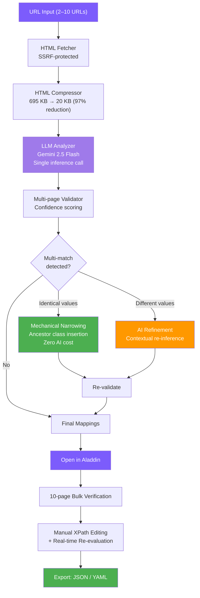

# XPathGenie: LLM-Driven Automated XPath Generation with Multi-Page Validation and Two-Tier Refinement

## Abstract

Web scraping remains labor-intensive, with XPath authoring as a major bottleneck. We present XPathGenie, a system that automates XPath mapping generation from raw URLs using HTML structural compression, LLM-based inference, multi-page cross-validation, and two-tier refinement. The compression stage reduces typical pages by approximately 97%, enabling efficient LLM consumption within token budgets. The system employs a single LLM inference call to produce field-XPath mappings, which are validated across multiple pages with confidence scoring. A two-tier refinement mechanism resolves multi-match XPaths: identical-value duplicates are narrowed mechanically at zero AI cost, while divergent-value cases trigger targeted re-inference. In evaluation across 22 Japanese medical job-listing websites, XPathGenie achieved a weighted average hit rate of 91.2% with schema-guided generation, with 11 sites reaching 100%. A key finding is that providing a unified field schema with semantic descriptions (Want List) improved accuracy by 11.7 percentage points over autonomous field discovery, suggesting that communicating extraction *intent* to the LLM—analogous to giving a human scraper a clear objective—is a powerful lever for accuracy. The system's architectural insight—using AI for one-time mapping discovery rather than per-page extraction—ensures zero ongoing AI cost after initial generation.

## 1. Introduction

Structured data extraction from websites is fundamental to competitive intelligence, job aggregation, price monitoring, and numerous data-driven applications. At the core of most extraction pipelines lies XPath—a query language for selecting nodes from HTML/XML documents. Despite its power, XPath authoring remains a predominantly manual craft.

The challenges are threefold. First, **time cost**: constructing a reliable XPath mapping for a single website typically requires several hours of expert effort, involving page inspection, expression writing, edge-case handling, and cross-page validation. For organizations managing portfolios of dozens of target sites, this translates to hundreds of hours of specialized labor. Second, **tacit knowledge dependency**: effective XPath construction requires understanding of common HTML patterns (definition lists, table layouts, nested containers), site-specific idiosyncrasies, and the distinction between main content and peripheral elements such as sidebars and recommendation widgets. This knowledge is difficult to systematize. Third, **scalability**: as target sites evolve their HTML structures, previously valid XPaths break, necessitating ongoing maintenance that scales linearly with portfolio size.

XPathGenie addresses these challenges by reformulating XPath generation as an LLM inference problem operating on structurally compressed HTML, augmented by deterministic validation and refinement stages. The key insight is that AI should be invoked exactly once—for initial mapping discovery—while all subsequent operations (validation, mechanical refinement, ongoing extraction) operate purely on DOM manipulation at zero marginal AI cost.

## 2. Related Work

Automated web data extraction has been studied extensively, yielding several families of approaches. We organize prior work into five categories.

### 2.1 Visual Scraping and CSS Selector Tools

**Visual scraping tools** (e.g., Octoparse, ParseHub, Import.io) provide point-and-click interfaces where users visually select elements. While reducing the need for XPath syntax knowledge, these tools still require manual element selection per field and per site, offering no automation of the mapping discovery itself. **CSS selector generators** (e.g., SelectorGadget, browser DevTools) automatically suggest selectors for clicked elements but operate on single elements and single pages, lacking cross-page generalization and batch field discovery.

### 2.2 Wrapper Induction

Wrapper induction systems learn extraction rules from labeled examples. Early work by Kushmerick et al. (1997) and Dalvi et al. (2011) established the paradigm of learning extraction patterns from annotated page sets. More recently, commercial systems such as **Diffbot** (Tong, 2014) and **Zyte Automatic Extraction** (formerly AutoExtract) apply machine learning to extract structured data from web pages without explicit rule authoring. These systems achieve strong results on common page types (articles, products) but rely on pre-trained models for specific verticals and may struggle with niche or unconventional layouts.

### 2.3 HTML-Aware Language Models

A family of language models has been developed specifically for understanding HTML/DOM structure. **MarkupLM** (Li et al., 2022) extends pre-trained language models with XPath-based position embeddings, enabling tasks such as web page classification and information extraction from semi-structured documents. **WebFormer** (Wang et al., 2022) proposes a Transformer architecture that models the relationship between HTML tokens and DOM structure for web page understanding. **DOM-LM** (Deng et al., 2022) pre-trains on DOM trees with structure-aware objectives. These models demonstrate that encoding HTML structure explicitly improves downstream extraction tasks, but they typically require fine-tuning on labeled data for each target schema.

### 2.4 LLM-Based Web Extraction

The emergence of large language models has enabled new approaches to web data extraction. **ScrapeGraphAI** (Perini et al., 2024) orchestrates LLM calls via a graph-based pipeline to extract structured data from web pages, supporting multiple LLM backends. However, ScrapeGraphAI invokes the LLM at extraction time for each page, meaning AI cost scales linearly with the number of pages processed. In contrast, XPathGenie uses the LLM solely to generate reusable XPath expressions, incurring AI cost only once per site mapping.

**Zero-shot extraction** approaches apply LLMs to extract structured data without task-specific training. Lockard et al. (2020) demonstrated zero-shot closed information extraction from semi-structured web pages (ZeroShotCeres). More recent work has explored using LLMs to generate CSS selectors or XPath expressions from natural-language descriptions of desired fields (Gur et al., 2023; Zhou et al., 2024), though these typically operate on single pages without cross-page validation.

Open-source crawling frameworks such as **FireCrawl** (2024) and **crawl4ai** (2024) convert web pages to LLM-friendly formats (Markdown, structured text) for downstream extraction. These tools focus on content conversion rather than reusable selector generation, and they invoke LLMs per page during extraction.

### 2.5 Boilerplate Detection and Content Extraction

Content extraction from web pages has a long history. Kohlschütter et al. (2010) proposed boilerplate detection using shallow text features, achieving effective separation of main content from peripheral elements. XPathGenie's HTML compression pipeline (Section 3.1) draws on similar intuitions—identifying and removing non-content elements—but operates at the DOM structural level to preserve the hierarchy needed for XPath construction.

### 2.6 Positioning

XPathGenie differs from all prior approaches in a critical architectural decision: the LLM generates *reusable XPath expressions*, not extracted data. This means AI cost is incurred once at mapping time, and all subsequent extractions are pure DOM queries—deterministic, fast, and free. The HTML compression pipeline further distinguishes our approach by enabling LLM analysis within practical token budgets. Unlike HTML-aware language models that require fine-tuning, XPathGenie leverages general-purpose LLMs with carefully engineered prompts. Unlike wrapper induction, it requires no labeled training data—only a small set of example URLs.

## 3. System Architecture

XPathGenie implements a six-stage pipeline from URL input to validated XPath mappings, followed by an optional human-in-the-loop verification stage via the companion tool Aladdin.



### 3.1 HTML Compression

Raw HTML pages from modern websites routinely exceed 500 KB, far exceeding practical LLM context windows when multiple pages must be analyzed simultaneously. The compression module (`genie/compressor.py`) applies a multi-pass structural reduction:

1. **Tag removal**: Elements with no extractable content are eliminated entirely: `script`, `style`, `noscript`, `iframe`, `svg`, `link`, `meta`, and `head`.

2. **Structural strip**: Layout-only containers (`header`, `footer`, `nav`, `aside`) are removed, as they rarely contain target data fields.

3. **Main section detection**: The algorithm locates the primary content region through a three-tier fallback: (a) explicit semantic elements (`<main>`, `<article>`), (b) **structured data detection**—the nearest common ancestor of `<th>` and `<dt>` elements, which reliably indicates data-rich regions on form-based sites, and (c) the `<div>` or `<section>` with the most text content. Noise patterns—elements whose class or ID matches `\brecommend\b|\brelated\b|\bsidebar\b|\bwidget\b|\bbreadcrumb\b|\bmodal\b|\bslide\b|\bfooter\b|\bbanner\b|\bad-|\bpopup\b|\bcookie\b`—are excluded at all tiers. The structured data detection (tier b) was added after initial evaluation revealed that sites without semantic landmarks often had their data tables excluded by the text-volume heuristic.

4. **Noise subtree removal**: Within the identified main section, child subtrees matching noise patterns are recursively removed.

5. **Text truncation**: All text nodes are truncated to 30 characters, preserving structural labels (e.g., `給与`, `勤務地`) while eliminating lengthy content that consumes tokens without aiding XPath generation.

6. **Empty element pruning**: Elements with no text content and no children are removed (excluding self-closing tags like `br`, `hr`, `img`, `input`).

7. **Whitespace normalization**: Redundant whitespace is collapsed, and inter-tag whitespace is eliminated.

The result is a structural skeleton that preserves the DOM hierarchy, class names, and label text essential for XPath construction while achieving approximately 97% size reduction (e.g., 695 KB → 20 KB). Each compressed page is further capped at 8,000 characters before being sent to the LLM.

### 3.2 LLM-Based XPath Generation

The system offers two inference modes, both implemented as single-call prompts to Gemini 2.5 Flash with `temperature=0.1` for near-deterministic output and `responseMimeType=application/json` for structured responses.

**Auto Discover mode** sends compressed HTML samples with instructions to identify all meaningful data fields and return a JSON mapping of field names to XPath expressions. The prompt enforces constraints critical for downstream reliability:

- XPaths must use the `//` prefix and select element nodes (not `text()` nodes)
- Class matching must use `contains(@class, ...)` to handle multi-class attributes
- XPath functions beyond `contains()` are prohibited (no `substring-after`, `normalize-space`)
- Output is limited to the 20 most important fields
- Field names must be lowercase English and semantically generic

**Want List mode** accepts a user-provided JSON schema where keys are desired field names and values are natural-language descriptions of the intended data. For example: `{"contract": "雇用形態 (employment type: 正社員/full-time, 契約社員/contract, パート/part-time, etc.)"}`. The LLM matches fields by *meaning* rather than literal label text, enabling cross-language semantic matching. This mode consumes approximately 30% fewer tokens than Auto Discover.

After LLM response, the system performs **automatic root prefixing**: the first compressed HTML's root element is inspected for a meaningful class name, which is prepended to all generated XPaths as a scoping container. This ensures XPaths are anchored to the main content region.

### 3.3 Multi-Page Validation

Generated XPaths are evaluated against the original (uncompressed) HTML of every fetched page. For each field, the validator computes:

- **Confidence score**: The fraction of pages where the XPath returns at least one non-empty result. A score of 1.0 indicates the XPath works across all analyzed pages. Note that this metric measures *extraction coverage*, not accuracy against ground-truth labels; the system does not compare extracted values to a gold standard.
- **Sample values**: The first 100 characters of extracted text from each page, enabling quick human inspection.
- **Multi-match warnings**: Fields where an XPath matches more than one DOM node on any page are flagged for refinement.

When multiple nodes match a single XPath, the validator selects the best match using the depth-weighted content scoring algorithm (Section 3.5).

### 3.4 Two-Tier Refinement

Job listing sites and similar structured-content websites frequently repeat labels across sections—a field labeled "勤務地" (work location) may appear in the main detail area, a sidebar summary, and a related-jobs widget. A single `//dt[text()='勤務地']/following-sibling::dd[1]` XPath will match all occurrences.

XPathGenie's refinement mechanism addresses this through a two-tier strategy:

**Tier 1: Mechanical narrowing (zero AI cost).** When all matched values are identical (e.g., the same job ID appearing in three places), the system performs deterministic DOM analysis. For each matched element, it traverses the ancestor chain looking for elements with class attributes. It then constructs candidate XPaths by inserting intermediate container selectors (e.g., `//div[contains(@class,'p-jobDetail-body')]`) between the root container and the core expression. The first candidate that produces exactly one match is adopted. This operation requires no LLM call and adds negligible computation.

**Design note on `narrow_by_first_match`:** The mechanical narrowing algorithm validates candidate XPaths against only the first page in the input set. This is a deliberate trade-off for performance—checking all pages for every candidate would be prohibitively slow. The subsequent re-validation stage (which runs against all pages) catches any narrowing that fails to generalize.

```
Before: //div[contains(@class,'p-offerContainer')]//div[contains(@class,'c-favoriteBtn')]/@data-job_id
→ 3 matches (identical value)

After:  //div[contains(@class,'p-offerContainer')]//div[contains(@class,'p-jobDetail-body')]//div[contains(@class,'c-favoriteBtn')]/@data-job_id
→ 1 match
```

**Tier 2: AI re-inference (contextual refinement).** When matched values differ (e.g., the main job's location vs. a recommended job's location), mechanical narrowing cannot determine which match is correct. In this case, the system sends the surrounding HTML context (up to 1,500 characters per match, maximum 4 matches) back to the LLM with a refinement prompt. The prompt instructs the model to identify the *primary* match—typically the most detailed content in the main job-detail section—and return a more specific XPath.

The refinement prompt explicitly guides the LLM to look for intermediate structural containers with meaningful class names, producing XPaths that are specific enough for single-match accuracy while remaining readable and maintainable.

After refinement, all mappings are re-validated to confirm that the refined XPaths maintain cross-page accuracy.

### 3.5 Depth-Weighted Content Scoring

When an XPath matches multiple nodes and a single "best" value must be selected for the sample display, the validator employs a content scoring algorithm that combines structural signals with DOM depth:

```python
score = 0
for ancestor in node.ancestors():
    if ancestor.tag in ('main', 'article'):
        score += 20
    elif ancestor.tag in ('aside', 'nav', 'footer'):
        score -= 20
    if class/id contains MAIN_SIGNALS ('detail', 'content', 'primary', ...):
        score += 10
    if class/id contains SIDE_SIGNALS ('sidebar', 'recommend', 'related', ...):
        score -= 10
score += depth  # deeper nesting = more specific context
```

The depth component reflects a key observation: in typical website layouts, the primary content area involves deeper nesting than peripheral elements like header shortcuts or sidebar summaries. Combined with semantic signals from tag names and class names, this heuristic reliably identifies the main-content instance among duplicates.

### 3.6 Human-in-the-Loop Verification (Aladdin)

While XPathGenie automates mapping generation, production deployment benefits from human verification. The companion tool **XPathAladdin** provides:

- **10-page bulk testing**: Users can input up to 10 URLs from the same site type, and Aladdin fetches all pages and evaluates every XPath against each.
- **Tab-based comparison**: Results are presented in a tabbed interface, allowing page-by-page inspection of extracted values.
- **Cross-page hit rate**: For each field, Aladdin displays how many pages returned a value, immediately surfacing page-specific elements.
- **Real-time XPath editing**: Users can modify XPaths directly in the interface, with immediate re-evaluation against all loaded pages.
- **Seamless handoff**: A single "Open in Aladdin" button in XPathGenie transfers all URLs and generated mappings via localStorage, requiring no manual data entry.
- **Export**: Verified mappings can be exported as JSON or YAML (compatible with the teddy_crawler extraction framework).

This architecture embodies a deliberate role reversal: traditionally, humans write XPaths and machines validate them; in XPathGenie's workflow, machines write XPaths and humans validate them.

## 4. Evaluation

### 4.1 Experimental Setup

XPathGenie was evaluated on a portfolio of 35 Japanese medical/healthcare job-listing websites spanning pharmacist, nursing, caregiving, and general medical domains. Of the 35 sites, 23 had SSR (server-side rendered) detail pages accessible via standard HTTP requests. The remaining 12 were excluded: 7 required JavaScript rendering (SPA), 3 returned HTTP errors (403/500) or required authentication, and 2 had other access issues. One additional site (ph-10) was excluded from the Want List evaluation due to Genie analysis failure, yielding 22 evaluated sites.

Each site was analyzed using a single detail-page URL, and the generated XPath mappings were cross-validated against 10 detail pages from the same site. The evaluation metric is **hit rate**: the fraction of pages on which a generated XPath returns at least one non-empty result. This measures extraction coverage, not semantic accuracy against ground-truth annotations.

Two evaluation conditions were tested:

- **Auto Discover mode**: No schema guidance; the LLM autonomously identifies fields and generates XPaths.
- **Want List mode**: A unified schema of 30 field definitions (e.g., `"contract": "雇用形態（正社員、契約社員、パート等）"`, `"facility_name": "勤務先の施設名・会社名"`) is provided, guiding the LLM on what to extract.

### 4.2 Results: Auto Discover Mode

| # | Site | Domain | Structure | Fields | Perfect | Hit Rate |
|---|------|--------|-----------|--------|---------|----------|
| 25 | w-medical-9 | Medical | th/td | 20 | 20/20 | **100.0%** |
| 13 | pharmapremium | Pharma | th/td | 20 | 20/20 | **100.0%** |
| 18 | nikken-care | Care | dt/dd | 17 | 17/17 | **100.0%** |
| 19 | nikken-nurse | Nurse | dt/dd | 17 | 17/17 | **100.0%** |
| 9 | oshigoto-lab | Medical | dt/dd+th/td | 16 | 16/16 | **100.0%** |
| 21 | MRT-nurse | Nurse | SPA* | 11 | 11/11 | **100.0%** |
| 24 | kaigo-work | Care | th/td | 14 | 14/14 | **100.0%** |
| 20 | cocofump | Care | dt/dd+th/td | 4 | 4/4 | **100.0%** |
| 35 | kaigokango | Care/Nurse | SPA* | 20 | 19/20 | 96.0% |
| 32 | yakusta | Pharma | dt/dd+th/td | 18 | 17/18 | 98.3% |
| 16 | pharmalink | Pharma | th/td | 20 | 16/20 | 96.5% |
| 4 | yakumatch | Pharma | th/td | 19 | 17/19 | 89.5% |
| 12 | bestcareer | Pharma | th/td (Shift-JIS) | 21 | 17/21 | 95.0% |
| 1 | tsukui-staff | Care | dt/dd | 20 | 14/20 | 82.5% |
| 8 | apuro | Pharma | dt/dd+th/td | 13 | 10/13 | 80.8% |
| 5 | mynavi | Pharma | dt/dd | 20 | 15/20 | 78.5% |
| 30 | mc-pharma | Pharma | th/td (Shift-JIS) | 25 | 24/25 | 98.4% |
| 10 | yakuzaishisyusyoku | Pharma | th/td | 11 | 9/11 | 96.4% |
| 14 | caresta | Care | th/td | 20 | 10/20 | 50.0% |
| 6 | phget | Pharma | th/td | 6 | 6/6 | 100.0% |
| 2 | selva-i | Pharma | dt/dd | 1 | 1/1 | 100.0% |
| 26 | firstnavi | Nurse | th/td | 1 | 1/1 | 100.0% |

\* Sites labeled SPA in preliminary analysis but found to be SSR-accessible.

**Note:** All Auto Discover results were obtained after system improvements (encoding auto-detection for Shift-JIS/EUC-JP, XML declaration stripping, and structured-data-aware main section detection). Initial runs on some sites (e.g., mc-pharma, bestcareer) produced significantly lower scores due to encoding failures; these engineering fixes are not part of the core algorithm but are prerequisites for correct HTML processing.

**Summary (Auto Discover, 22 sites):** Weighted average hit rate **79.5%**. 10 sites achieved 100%. 13 sites exceeded 90%.

### 4.3 Results: Want List Mode (Schema-Guided)

The same 22 sites were re-evaluated using Want List mode with a unified 30-field job-listing schema.

| # | Site | Domain | Fields | Perfect | Hit Rate | Δ vs Auto |
|---|------|--------|--------|---------|----------|-----------|
| 25 | w-medical-9 | Medical | 20 | 20/20 | **100.0%** | — |
| 35 | kaigokango | Care/Nurse | 25 | 25/25 | **100.0%** | +4.0 |
| 13 | pharmapremium | Pharma | 20 | 20/20 | **100.0%** | — |
| 18 | nikken-care | Care | 12 | 12/12 | **100.0%** | — |
| 19 | nikken-nurse | Nurse | 16 | 16/16 | **100.0%** | — |
| 20 | cocofump | Care | 6 | 6/6 | **100.0%** | — |
| 21 | MRT-nurse | Nurse | 11 | 11/11 | **100.0%** | — |
| 9 | oshigoto-lab | Medical | 11 | 11/11 | **100.0%** | — |
| 6 | phget | Pharma | 6 | 6/6 | **100.0%** | +85.7 |
| 2 | selva-i | Pharma | 1 | 1/1 | **100.0%** | — |
| 26 | firstnavi | Nurse | 1 | 1/1 | **100.0%** | — |
| 30 | mc-pharma | Pharma | 25 | 24/25 | **98.4%** | +93.1 |
| 32 | yakusta | Pharma | 14 | 13/14 | **97.9%** | -0.4 |
| 10 | yakuzaishisyusyoku | Pharma | 11 | 9/11 | **96.4%** | +57.9 |
| 16 | pharmalink | Pharma | 16 | 12/16 | **96.2%** | -0.3 |
| 8 | apuro | Pharma | 12 | 10/12 | **86.7%** | +5.9 |
| 1 | tsukui-staff | Care | 23 | 16/23 | **86.1%** | +3.6 |
| 24 | kaigo-work | Care | 25 | 21/25 | **84.0%** | -16.0 |
| 4 | yakumatch | Pharma | 6 | 5/6 | **83.3%** | -6.2 |
| 12 | bestcareer | Pharma | 21 | 17/21 | **81.0%** | -14.0 |
| 5 | mynavi | Pharma | 26 | 18/26 | **72.3%** | -6.2 |
| 14 | caresta | Care | 19 | 11/19 | **57.9%** | +7.9 |

**Summary (Want List, 22 sites):** Weighted average hit rate **91.2%** (+11.7pt vs Auto Discover). 11 sites achieved 100%. 20 of 22 sites exceeded 80%.

### 4.4 Schema Guidance Effect Analysis

The Want List produced dramatic improvements on sites that were previously low-performing:

| Site | Auto Discover | Want List | Change |
|------|--------------|-----------|--------|
| mc-pharma | 5.3% | 98.4% | **+93.1pt** |
| phget | 14.3% | 100.0% | **+85.7pt** |
| yakuzaishisyusyoku | 38.5% | 96.4% | **+57.9pt** |
| bestcareer | 0% (failed) | 81.0% | **recovered** |

The effect is most pronounced on sites where Auto Discover failed to identify the correct HTML structure for data fields. By providing semantic descriptions of desired fields (e.g., `"contract": "雇用形態（正社員、契約社員、パート等）"`), the Want List effectively guides the LLM to match fields by *meaning* rather than relying solely on DOM pattern recognition. This is analogous to providing a human scraper with a data dictionary before they inspect an unfamiliar site.

Conversely, a few sites showed slight decreases with Want List (e.g., kaigo-work -16.0pt, bestcareer -14.0pt). This occurs when the Want List's field definitions do not align well with the site's actual data structure—the LLM attempts to force-match fields that don't exist on the site, generating XPaths that fail validation.

### 4.5 Results by HTML Structure

| HTML Structure | Sites | Avg Hit Rate (Want List) | 100% Rate |
|----------------|-------|--------------------------|-----------|
| th/td table | 11 | 92.8% | 36.4% |
| dt/dd definition list | 5 | 94.5% | 60.0% |
| dt/dd + th/td mixed | 4 | 96.2% | 50.0% |
| SPA (SSR-accessible) | 2 | 100.0% | 100.0% |

Structured HTML patterns (dt/dd, th/td) consistently achieved high accuracy. Mixed structures performed slightly better, likely because they provide more structural signals for the LLM.

### 4.6 Excluded Sites

| Category | Count | Sites |
|----------|-------|-------|
| SPA (JS rendering required) | 7 | #7, #11, #15, #22, #27, #28, #29 |
| HTTP error / auth required | 3 | #3 (403), #17 (500), #23 (login) |
| JS-dependent content | 1 | #34 (empty main tag) |
| URL discovery failure | 1 | #33 |
| Genie analysis failure | 1 | #31 (ph-10) |

### 4.7 Effort Reduction

| Metric | Manual Process | XPathGenie |
|--------|---------------|------------|
| Time per site (generation only) | 5–6 hours | ~20 seconds |
| Total for 22 sites (generation only) | 110–130 hours | ~7 minutes |
| Skill requirement | Senior engineer with domain expertise | Any operator with URL access |
| Ongoing AI cost | N/A | Zero (XPaths are reusable) |

The manual time estimate of 5–6 hours per site is based on the authors' experience with this specific medical job scraping portfolio and may not generalize to other domains. The XPathGenie times measure only the automated generation step; Aladdin verification adds 5–15 minutes per site.

### 4.8 Token Efficiency

The HTML compression pipeline is critical to cost-effectiveness. Without compression, sending 10 pages of raw HTML (~500 KB each) would consume approximately 1,000,000+ tokens per request—infeasible for most LLM APIs. After compression (average 97% reduction, capped at 8,000 characters per page), total token consumption is 8,000–18,000 per analysis. Average Genie processing time was 20.7 seconds per site (median: 19.1s).

## 5. Design Principles

### 5.1 "Why > What" — Communicating Intent to the LLM

A central design principle in XPathGenie's prompt engineering is providing the LLM with *why* a constraint exists rather than merely *what* the constraint is. For example, the instruction to use `contains(@class, ...)` is accompanied by the explanation "because classes often have multiple values." Similarly, the prohibition on container prefixes is explained with contrasting examples showing correct and incorrect output.

This principle extends to the Want List mode, where field descriptions serve as semantic intent signals: `"contract": "雇用形態 (employment type)"` tells the LLM not just to find a "contract" field, but *why* specific HTML elements qualify—they contain employment type information such as 正社員 (full-time), 契約社員 (contract employee), or パート (part-time). The LLM can then match 雇用形態 (employment type), 就業形態 (work style), or "Employment Type" to the same field.

The auto-detection of intermediate containers during mechanical refinement (Section 3.4, Tier 1) is another manifestation: rather than hardcoding container class names, the system discovers them dynamically by traversing ancestor chains, allowing it to adapt to arbitrary site structures without site-specific configuration.

### 5.2 Role Reversal

Traditional web scraping workflow:
- **Human**: writes XPaths (creative, error-prone)
- **Machine**: executes XPaths (mechanical, reliable)

XPathGenie's workflow:
- **Machine**: writes XPaths (LLM inference + mechanical refinement)
- **Human**: verifies XPaths (Aladdin — visual inspection of extracted values)

The structural relationship is preserved—one party creates, the other validates—but the roles are swapped. Humans are better at recognizing "this value looks correct" than at constructing `//dl[dt[text()='給与']]/dd` from scratch. Machines are better at systematic pattern matching across HTML structures than at quality-judging extracted values in context.

### 5.3 Cost Optimization — AI Once, DOM Forever

XPathGenie's most consequential architectural decision is that the LLM is invoked exactly once (or twice, if AI refinement is triggered) per site mapping. The output is a set of reusable XPath expressions—deterministic, portable, and executable without any AI infrastructure.

This stands in contrast to approaches that invoke LLMs per extraction run, where cost scales linearly with the number of pages processed. For a site with 10,000 pages, XPathGenie's approach costs the same as for 1 page: one mapping generation, then pure `lxml.xpath()` calls.

The two-tier refinement further optimizes cost: Tier 1 mechanical narrowing resolves the majority of multi-match cases through DOM traversal (zero AI cost), reserving the more expensive AI re-inference for only the cases where value disambiguation is truly required.

## 6. Limitations and Future Work

**Single-Page Application (SPA) support.** XPathGenie currently fetches raw HTML via HTTP requests. Sites that render content dynamically via JavaScript (React, Vue, Angular SPAs) return empty or skeleton HTML, making XPath generation unreliable or infeasible. Integration with a headless browser (e.g., Playwright) for JavaScript-rendered HTML is a planned enhancement.

**Site structure evolution.** Generated XPaths are inherently tied to a site's DOM structure at the time of analysis. When sites undergo redesigns or structural changes, XPaths may break. A periodic re-analysis mechanism or change-detection system would improve production robustness.

**Main section detection fallback.** The `_find_main_section` algorithm falls back to selecting the `<div>` or `<section>` with the most text content when no `<main>` or `<article>` element is found. This heuristic can be fragile on pages where the highest-text-volume element is not the primary content area (e.g., pages with large comment sections or extensive footer content). Misidentifying the main section can cause the compressor to discard relevant content, leading to incomplete XPath mappings.

**teddy_crawler integration.** The YAML export format is designed for compatibility with the teddy_crawler web crawling framework. Deeper integration—such as automatic pipeline configuration generation—would further reduce the gap between mapping generation and production extraction.

**Compression fidelity.** The aggressive compression (text truncation at 30 characters, noise pattern removal) occasionally eliminates structural elements that are relevant for XPath construction. Adaptive compression that preserves more structure for complex pages could improve accuracy on edge cases.

**Multi-language and multi-domain generalization.** Current evaluation focuses on Japanese job-listing sites. While the architecture is language-agnostic, broader evaluation across languages and domains would strengthen generalizability claims.

**Comprehensive multi-domain evaluation.** The current evaluation (Section 4) covers 22 sites in a single domain (Japanese medical/healthcare job listings). While this represents a substantial improvement over the preliminary 2-site evaluation, broader evaluation across languages and domains (e-commerce, news, real estate) would strengthen generalizability claims.

**Ground-truth comparison.** The current hit rate metric measures extraction coverage (whether XPaths return non-empty values), not semantic accuracy (whether the correct value is extracted for the intended field). A ground-truth evaluation comparing extracted values against manually annotated data would provide stronger accuracy claims.

### 6.1 Threats to Validity

Several factors limit the validity of the current evaluation:

- **LLM non-determinism.** Although the system uses `temperature=0.1` for near-deterministic output, LLM responses can still vary across runs due to model updates, API-level batching, and inherent sampling stochasticity. The reported results reflect single runs and may not be perfectly reproducible.
- **Single-domain evaluation.** The evaluation covers 22 websites in one domain (Japanese medical job listings). The extent to which results generalize to other domains and languages is unknown.
- **Subjectivity of manual effort estimates.** The 5–6 hour manual baseline is based on the authors' own experience with a specific site portfolio and engineering workflow. Different engineers, tools, or site complexities could yield substantially different baselines, making the effort reduction comparison inherently approximate.
- **Hit rate vs accuracy.** The evaluation metric (hit rate) measures whether XPaths return non-empty values, not whether the returned values are semantically correct. A field might achieve 100% hit rate while extracting incorrect data. Human verification via Aladdin is still recommended for production use.

## 7. Conclusion

XPathGenie demonstrates that LLM-based XPath generation, when combined with aggressive HTML compression, deterministic multi-page validation, and a two-tier refinement mechanism, can achieve high extraction coverage on production websites. In evaluation across 22 Japanese medical job-listing sites, the system achieved a weighted average hit rate of 91.2% with schema-guided generation (Want List mode), with 11 of 22 sites reaching 100% and 20 of 22 exceeding 80%.

A key finding is the significant impact of schema guidance: providing a unified field schema with semantic descriptions improved the weighted average hit rate by 11.7 percentage points compared to autonomous field discovery. The effect was most dramatic on sites with non-standard HTML structures, where schema guidance improved hit rates by up to 93 percentage points. This suggests that communicating extraction *intent*—what the user wants to obtain—to the LLM is a powerful lever for accuracy. When humans inspect an unfamiliar web page, they naturally filter information through the lens of what they are looking for; without this objective, all content appears equally relevant. The Want List mechanism provides the LLM with an analogous "desire"—a structured expression of what matters—enabling it to focus on semantically relevant DOM regions rather than treating all HTML structure uniformly.

The system's architectural insight—using AI for one-time mapping discovery rather than per-page extraction—ensures that ongoing operational costs are zero after initial generation. The two-tier refinement mechanism, which resolves identical-value duplicates mechanically and reserves AI re-inference for genuinely ambiguous cases, exemplifies a broader design principle of minimizing AI invocations by maximizing deterministic preprocessing. Together with the Aladdin human-in-the-loop verification tool, XPathGenie establishes a complete workflow where machines create and humans verify, inverting the traditional division of labor in web data extraction.

## References

1. Kushmerick, N., Weld, D. S., & Doorenbos, R. (1997). Wrapper induction for information extraction. *Proceedings of the 15th International Joint Conference on Artificial Intelligence (IJCAI)*, 729–735.

2. Dalvi, N., Kumar, R., & Soliman, M. (2011). Automatic wrappers for large scale web extraction. *Proceedings of the VLDB Endowment*, 4(4), 219–230.

3. Ferrara, E., De Meo, P., Fiumara, G., & Baumgartner, R. (2014). Web data extraction, applications and techniques: A survey. *Knowledge-Based Systems*, 70, 301–323.

4. Kohlschütter, C., Fankhauser, P., & Nejdl, W. (2010). Boilerplate detection using shallow text features. *Proceedings of the Third ACM International Conference on Web Search and Data Mining (WSDM)*, 441–450.

5. Lockard, C., Dong, X. L., Einolghozati, A., & Shiralkar, P. (2020). ZeroShotCeres: Zero-shot relation extraction from semi-structured webpages. *Proceedings of the 58th Annual Meeting of the Association for Computational Linguistics (ACL)*, 8105–8117.

6. Li, J., Xu, Y., Cui, L., & Wei, F. (2022). MarkupLM: Pre-training of text and markup language for visually rich document understanding. *Proceedings of the 60th Annual Meeting of the Association for Computational Linguistics (ACL)*, 6078–6087.

7. Wang, X., Jiang, Y., Bach, N., Wang, T., Huang, Z., Huang, F., & Tu, K. (2022). WebFormer: The web-page transformer for structure information extraction. *Proceedings of the ACM Web Conference 2022*, 3124–3133.

8. Deng, X., Sun, Y., Galley, M., & Gao, J. (2022). DOM-LM: Learning generalizable representations for HTML documents. *arXiv preprint arXiv:2201.10608*.

9. Tong, M. (2014). Diffbot: A visual learning agent for the web. *Diffbot Technologies*. https://www.diffbot.com/

10. Gur, I., Furuta, H., Huang, A., Saber, M., Matsuo, Y., Eck, D., & Faust, A. (2023). A real-world WebAgent with planning, long context understanding, and program synthesis. *arXiv preprint arXiv:2307.12856*.

11. Perini, M., Samardzic, L., & Pozzoli, M. (2024). ScrapeGraphAI: A web scraping python library that uses LLM and direct graph logic to create scraping pipelines. *arXiv preprint arXiv:2411.13104*.

12. FireCrawl. (2024). FireCrawl: Turn websites into LLM-ready data. https://firecrawl.dev/

13. crawl4ai. (2024). crawl4ai: Open-source LLM-friendly web crawler. https://github.com/unclecode/crawl4ai

14. Google. (2025). Gemini 2.5 Flash. *Google DeepMind*. https://deepmind.google/technologies/gemini/

15. Clark, J., & DeRose, S. (1999). XML Path Language (XPath) Version 1.0. *W3C Recommendation*. https://www.w3.org/TR/xpath/
