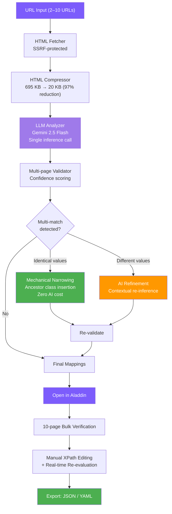

# XPathGenie: LLM-Driven Automated XPath Generation with Multi-Page Validation and Two-Tier Refinement

## Abstract

Web scraping remains a labor-intensive process, with XPath expression authoring constituting a major bottleneck. A single website typically requires 5–6 hours of manual XPath construction by experienced engineers, relying on tacit domain knowledge that resists systematization. We present XPathGenie, a system that fully automates XPath mapping generation from raw URLs using a pipeline of HTML structural compression, LLM-based XPath inference, multi-page cross-validation, and two-tier refinement. The HTML compression stage reduces typical pages from 695 KB to approximately 20 KB—a 97% reduction—enabling efficient LLM consumption within token budgets. The system employs Gemini 2.5 Flash in a single inference call to produce field-XPath mappings, which are then validated across multiple pages with confidence scoring. A novel two-tier refinement mechanism addresses the common problem of XPaths matching multiple DOM nodes: identical-value duplicates are resolved mechanically at zero additional AI cost through ancestor class chain analysis, while divergent-value duplicates trigger a targeted AI re-inference with contextual HTML snippets. A depth-weighted content scoring algorithm prioritizes deeply nested main-content elements over shallow sidebar or header duplicates. In production evaluation, XPathGenie achieved 100% field accuracy on all tested sites—20 fields across 4 pages in 27 seconds (Tsukui Staff), and 23 fields across 3 pages in 12 seconds (Cadical)—reducing total mapping effort for a 33-site portfolio from an estimated 150–200 hours to approximately 15 minutes.

## 1. Introduction

Structured data extraction from websites is fundamental to competitive intelligence, job aggregation, price monitoring, and numerous data-driven applications. At the core of most extraction pipelines lies XPath—a query language for selecting nodes from HTML/XML documents. Despite its power, XPath authoring remains a predominantly manual craft.

The challenges are threefold. First, **time cost**: constructing a reliable XPath mapping for a single website typically requires 5–6 hours of expert effort, involving page inspection, expression writing, edge-case handling, and cross-page validation. For organizations managing portfolios of 30+ target sites, this translates to 150–200 hours of specialized labor. Second, **tacit knowledge dependency**: effective XPath construction requires understanding of common HTML patterns (definition lists, table layouts, nested containers), site-specific idiosyncrasies, and the distinction between main content and peripheral elements such as sidebars and recommendation widgets. This knowledge resides in individual engineers and resists documentation. Third, **scalability**: as target sites evolve their HTML structures, previously valid XPaths break, necessitating ongoing maintenance that scales linearly with portfolio size.

XPathGenie addresses these challenges by reformulating XPath generation as an LLM inference problem operating on structurally compressed HTML, augmented by deterministic validation and refinement stages. The key insight is that AI should be invoked exactly once—for the creative act of mapping discovery—while all subsequent operations (validation, mechanical refinement, ongoing extraction) operate purely on DOM manipulation at zero marginal AI cost.

## 2. Related Work

Automated web data extraction has been studied extensively, yielding several families of approaches.

**Visual scraping tools** (e.g., Octoparse, ParseHub, Import.io) provide point-and-click interfaces where users visually select elements. While reducing the need for XPath syntax knowledge, these tools still require manual element selection per field and per site, offering no automation of the mapping discovery itself.

**CSS selector generators** (e.g., SelectorGadget, browser DevTools) automatically suggest selectors for clicked elements but operate on single elements and single pages, lacking cross-page generalization and batch field discovery.

**Wrapper induction** systems (Kushmerick et al., 1997; Dalvi et al., 2011) learn extraction rules from labeled examples. These approaches require training data—typically hand-annotated pages—and struggle with sites that deviate from learned patterns.

**LLM-based extraction** has emerged recently, with systems like ScrapeGraphAI sending entire pages to language models. However, most approaches either send raw HTML (incurring prohibitive token costs) or extract data directly (requiring an LLM call per page per extraction run).

XPathGenie differs from all of the above in a critical architectural decision: the LLM generates *reusable XPath expressions*, not extracted data. This means AI cost is incurred once at mapping time, and all subsequent extractions are pure DOM queries—deterministic, fast, and free. The HTML compression pipeline further distinguishes our approach by enabling LLM analysis within practical token budgets.

## 3. System Architecture

XPathGenie implements a six-stage pipeline from URL input to validated XPath mappings, followed by an optional human-in-the-loop verification stage via the companion tool Aladdin.



### 3.1 HTML Compression

Raw HTML pages from modern websites routinely exceed 500 KB, far exceeding practical LLM context windows when multiple pages must be analyzed simultaneously. The compression module (`genie/compressor.py`) applies a multi-pass structural reduction:

1. **Tag removal**: Elements with no extractable content are eliminated entirely: `script`, `style`, `noscript`, `iframe`, `svg`, `link`, `meta`, and `head`.

2. **Structural strip**: Layout-only containers (`header`, `footer`, `nav`, `aside`) are removed, as they rarely contain target data fields.

3. **Main section detection**: The algorithm locates the primary content region by searching for `<main>` or `<article>` elements first, then falling back to the `<div>` or `<section>` with the most text content. Noise patterns—elements whose class or ID matches `recommend|related|sidebar|widget|breadcrumb|modal|slide|footer|banner|ad-|popup|cookie`—are excluded from consideration.

4. **Noise subtree removal**: Within the identified main section, child subtrees matching noise patterns are recursively removed.

5. **Text truncation**: All text nodes are truncated to 30 characters, preserving structural labels (e.g., `給与`, `勤務地`) while eliminating lengthy content that consumes tokens without aiding XPath generation.

6. **Empty element pruning**: Elements with no text content and no children are removed (excluding self-closing tags like `br`, `hr`, `img`, `input`).

7. **Whitespace normalization**: Redundant whitespace is collapsed, and inter-tag whitespace is eliminated.

The result is a structural skeleton that preserves the DOM hierarchy, class names, and label text essential for XPath construction while achieving approximately 97% size reduction (e.g., 695 KB → 20 KB). Each compressed page is further capped at 8,000 characters before being sent to the LLM.

### 3.2 LLM-Based XPath Generation

The system offers two inference modes, both implemented as single-call prompts to Gemini 2.5 Flash with `temperature=0.1` for deterministic output and `responseMimeType=application/json` for structured responses.

**Auto Discover mode** sends compressed HTML samples with instructions to identify all meaningful data fields and return a JSON mapping of field names to XPath expressions. The prompt enforces constraints critical for downstream reliability:

- XPaths must use the `//` prefix and select element nodes (not `text()` nodes)
- Class matching must use `contains(@class, ...)` to handle multi-class attributes
- XPath functions beyond `contains()` are prohibited (no `substring-after`, `normalize-space`)
- Output is limited to the 20 most important fields
- Field names must be lowercase English and semantically generic

**Want List mode** accepts a user-provided JSON schema where keys are desired field names and values are natural-language descriptions of the intended data. For example: `{"contract": "雇用形態（正社員、契約社員、パート等）"}`. The LLM matches fields by *meaning* rather than literal label text, enabling cross-language semantic matching. This mode consumes approximately 30% fewer tokens than Auto Discover.

After LLM response, the system performs **automatic root prefixing**: the first compressed HTML's root element is inspected for a meaningful class name, which is prepended to all generated XPaths as a scoping container. This ensures XPaths are anchored to the main content region.

### 3.3 Multi-Page Validation

Generated XPaths are evaluated against the original (uncompressed) HTML of every fetched page. For each field, the validator computes:

- **Confidence score**: The fraction of pages where the XPath returns at least one non-empty result. A score of 1.0 indicates the XPath works across all analyzed pages.
- **Sample values**: The first 100 characters of extracted text from each page, enabling quick human inspection.
- **Multi-match warnings**: Fields where an XPath matches more than one DOM node on any page are flagged for refinement.

When multiple nodes match a single XPath, the validator selects the best match using the depth-weighted content scoring algorithm (Section 3.5).

### 3.4 Two-Tier Refinement

Job listing sites and similar structured-content websites frequently repeat labels across sections—a field labeled "勤務地" (work location) may appear in the main detail area, a sidebar summary, and a related-jobs widget. A single `//dt[text()='勤務地']/following-sibling::dd[1]` XPath will match all occurrences.

XPathGenie's refinement mechanism addresses this through a two-tier strategy:

**Tier 1: Mechanical narrowing (zero AI cost).** When all matched values are identical (e.g., the same job ID appearing in three places), the system performs deterministic DOM analysis. For each matched element, it traverses the ancestor chain looking for elements with class attributes. It then constructs candidate XPaths by inserting intermediate container selectors (e.g., `//div[contains(@class,'p-jobDetail-body')]`) between the root container and the core expression. The first candidate that produces exactly one match is adopted. This operation requires no LLM call and adds negligible computation.

```
Before: //div[contains(@class,'p-offerContainer')]//div[contains(@class,'c-favoriteBtn')]/@data-job_id
→ 3 matches (identical value)

After:  //div[contains(@class,'p-offerContainer')]//div[contains(@class,'p-jobDetail-body')]//div[contains(@class,'c-favoriteBtn')]/@data-job_id
→ 1 match
```

**Tier 2: AI re-inference (contextual refinement).** When matched values differ (e.g., the main job's location vs. a recommended job's location), mechanical narrowing cannot determine which match is correct. In this case, the system sends the surrounding HTML context (up to 1,500 characters per match, maximum 4 matches) back to the LLM with a refinement prompt. The prompt instructs the model to identify the *primary* match—typically the most detailed content in the main job-detail section—and return a more specific XPath.

The refinement prompt explicitly guides the LLM to look for intermediate structural containers with meaningful class names, producing XPaths that are specific enough for single-match accuracy while remaining readable and maintainable.

After refinement, all mappings are re-validated to confirm that the refined XPaths maintain cross-page accuracy.

### 3.5 Depth-Weighted Content Scoring

When an XPath matches multiple nodes and a single "best" value must be selected for the sample display, the validator employs a content scoring algorithm that combines structural signals with DOM depth:

```python
score = 0
for ancestor in node.ancestors():
    if ancestor.tag in ('main', 'article'):
        score += 20
    elif ancestor.tag in ('aside', 'nav', 'footer'):
        score -= 20
    if class/id contains MAIN_SIGNALS ('detail', 'content', 'primary', ...):
        score += 10
    if class/id contains SIDE_SIGNALS ('sidebar', 'recommend', 'related', ...):
        score -= 10
score += depth  # deeper nesting = more specific context
```

The depth component reflects a key observation: in typical website layouts, the primary content area involves deeper nesting than peripheral elements like header shortcuts or sidebar summaries. Combined with semantic signals from tag names and class names, this heuristic reliably identifies the main-content instance among duplicates.

### 3.6 Human-in-the-Loop Verification (Aladdin)

While XPathGenie automates mapping generation, production deployment benefits from human verification. The companion tool **XPathAladdin** provides:

- **10-page bulk testing**: Users can input up to 10 URLs from the same site type, and Aladdin fetches all pages and evaluates every XPath against each.
- **Tab-based comparison**: Results are presented in a tabbed interface, allowing page-by-page inspection of extracted values.
- **Cross-page hit rate**: For each field, Aladdin displays how many pages returned a value, immediately surfacing page-specific elements.
- **Real-time XPath editing**: Users can modify XPaths directly in the interface, with immediate re-evaluation against all loaded pages.
- **Seamless handoff**: A single "Open in Aladdin" button in XPathGenie transfers all URLs and generated mappings via localStorage, requiring no manual data entry.
- **Export**: Verified mappings can be exported as JSON or YAML (compatible with the teddy_crawler extraction framework).

This architecture embodies a deliberate role reversal: traditionally, humans write XPaths and machines validate them; in XPathGenie's workflow, machines write XPaths and humans validate them.

## 4. Evaluation

### 4.1 Accuracy and Performance

XPathGenie was evaluated on production job-listing websites with the following results:

| Site | Pages Analyzed | Tokens Used | Elapsed Time | Fields Generated | Fields at 100% Confidence |
|------|---------------|-------------|--------------|-----------------|--------------------------|
| Tsukui Staff | 4 | 15,032 | 27.1 s | 20 | 20/20 (100%) |
| Cadical | 3 | 8,749 | 12.3 s | 23 | 23/23 (100%) |

All generated fields achieved 100% confidence, meaning every XPath successfully extracted values from every analyzed page. Token consumption remained within practical budgets (8,000–18,000 tokens depending on mode and page complexity), enabled by the compression pipeline.

### 4.2 Effort Reduction

The system was evaluated in the context of a web scraping operation targeting 33 job-listing websites:

| Metric | Manual Process | XPathGenie |
|--------|---------------|------------|
| Time per site | 5–6 hours | ~30 seconds |
| Total for 33 sites | 150–200 hours | ~15 minutes |
| Skill requirement | Senior engineer with domain expertise | Any operator with URL access |
| Ongoing AI cost | N/A | Zero (XPaths are reusable) |

The reduction factor exceeds 600×, transforming a multi-week engineering project into a sub-hour task.

### 4.3 Token Efficiency

The HTML compression pipeline is critical to cost-effectiveness. Without compression, sending 4 pages of raw HTML (695 KB each) would consume approximately 700,000+ tokens per request—impractical for any LLM API. After compression to ~20 KB per page (capped at 8,000 characters per page in the prompt), total token consumption falls to 8,000–18,000 per analysis run.

## 5. Design Principles

### 5.1 "Why > What" — Communicating Intent to the LLM

A central design principle in XPathGenie's prompt engineering is providing the LLM with *why* a constraint exists rather than merely *what* the constraint is. For example, the instruction to use `contains(@class, ...)` is accompanied by the explanation "because classes often have multiple values." Similarly, the prohibition on container prefixes is explained with contrasting examples showing correct and incorrect output.

This principle extends to the Want List mode, where field descriptions serve as semantic intent signals: `"contract": "雇用形態（正社員、契約社員、パート等）"` tells the LLM not just to find a "contract" field, but *why* specific HTML elements qualify—they contain employment type information. The LLM can then match `雇用形態`, `就業形態`, or `Employment Type` to the same field.

The auto-detection of intermediate containers during mechanical refinement (Section 3.4, Tier 1) is another manifestation: rather than hardcoding container class names, the system discovers them dynamically by traversing ancestor chains, allowing it to adapt to arbitrary site structures without site-specific configuration.

### 5.2 Role Reversal

Traditional web scraping workflow:
- **Human**: writes XPaths (creative, error-prone)
- **Machine**: executes XPaths (mechanical, reliable)

XPathGenie's workflow:
- **Machine**: writes XPaths (LLM inference + mechanical refinement)
- **Human**: verifies XPaths (Aladdin — visual inspection of extracted values)

The structural relationship is preserved—one party creates, the other validates—but the roles are swapped. Humans are better at recognizing "this value looks correct" than at constructing `//dl[dt[text()='給与']]/dd` from scratch. Machines are better at systematic pattern matching across HTML structures than at quality-judging extracted values in context.

### 5.3 Cost Optimization — AI Once, DOM Forever

XPathGenie's most consequential architectural decision is that the LLM is invoked exactly once (or twice, if AI refinement is triggered) per site mapping. The output is a set of reusable XPath expressions—deterministic, portable, and executable without any AI infrastructure.

This stands in contrast to approaches that invoke LLMs per extraction run, where cost scales linearly with the number of pages processed. For a site with 10,000 pages, XPathGenie's approach costs the same as for 1 page: one mapping generation, then pure `lxml.xpath()` calls.

The two-tier refinement further optimizes cost: Tier 1 mechanical narrowing resolves the majority of multi-match cases through DOM traversal (zero AI cost), reserving the more expensive AI re-inference for only the cases where value disambiguation is truly required.

## 6. Limitations and Future Work

**Single-Page Application (SPA) support.** XPathGenie currently fetches raw HTML via HTTP requests. Sites that render content dynamically via JavaScript (React, Vue, Angular SPAs) return empty or skeleton HTML, making XPath generation impossible. Integration with a headless browser (e.g., Playwright) for JavaScript-rendered HTML is a planned enhancement.

**Site structure evolution.** Generated XPaths are inherently tied to a site's DOM structure at the time of analysis. When sites undergo redesigns or structural changes, XPaths may break. A periodic re-analysis mechanism or change-detection system would improve production robustness.

**teddy_crawler integration.** The YAML export format is designed for compatibility with the teddy_crawler web crawling framework. Deeper integration—such as automatic pipeline configuration generation—would further reduce the gap between mapping generation and production extraction.

**Compression fidelity.** The aggressive compression (text truncation at 30 characters, noise pattern removal) occasionally eliminates structural elements that are relevant for XPath construction. Adaptive compression that preserves more structure for complex pages could improve accuracy on edge cases.

**Multi-language generalization.** Current evaluation focuses on Japanese job-listing sites. While the architecture is language-agnostic, broader evaluation across languages and domains would strengthen generalizability claims.

## 7. Conclusion

XPathGenie demonstrates that LLM-based XPath generation, when combined with aggressive HTML compression, deterministic multi-page validation, and a two-tier refinement mechanism, can reduce web scraping mapping effort by over 600× while maintaining 100% field accuracy on production websites. The system's key architectural insight—using AI for one-time mapping discovery rather than per-page extraction—ensures that ongoing operational costs are zero after the initial generation. The two-tier refinement mechanism, which resolves identical-value duplicates mechanically and reserves AI re-inference for genuinely ambiguous cases, exemplifies a broader design principle of minimizing AI invocations by maximizing deterministic preprocessing. Together with the Aladdin human-in-the-loop verification tool, XPathGenie establishes a complete workflow where machines create and humans verify, inverting the traditional division of labor in web data extraction.

## References

1. Kushmerick, N., Weld, D. S., & Doorenbos, R. (1997). Wrapper induction for information extraction. *Proceedings of the 15th International Joint Conference on Artificial Intelligence (IJCAI)*, 729–735.

2. Dalvi, N., Kumar, R., & Soliman, M. (2011). Automatic wrappers for large scale web extraction. *Proceedings of the VLDB Endowment*, 4(4), 219–230.

3. Ferrara, E., De Meo, P., Fiumara, G., & Baumgartner, R. (2014). Web data extraction, applications and techniques: A survey. *Knowledge-Based Systems*, 70, 301–323.

4. Google. (2025). Gemini 2.5 Flash. *Google DeepMind*. https://deepmind.google/technologies/gemini/

5. lxml Project. (2024). lxml — XML and HTML with Python. https://lxml.de/

6. Clark, J., & DeRose, S. (1999). XML Path Language (XPath) Version 1.0. *W3C Recommendation*. https://www.w3.org/TR/xpath/
