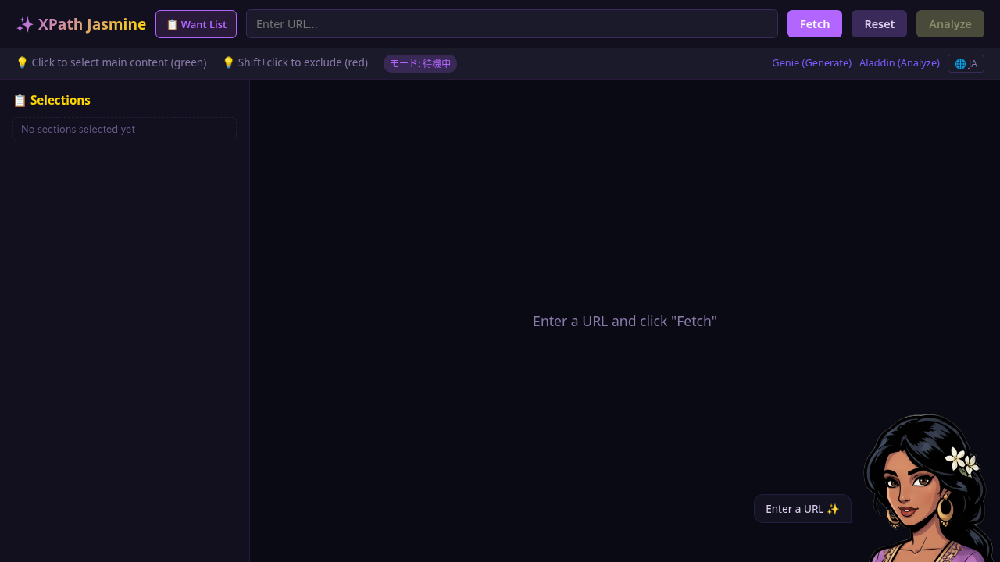
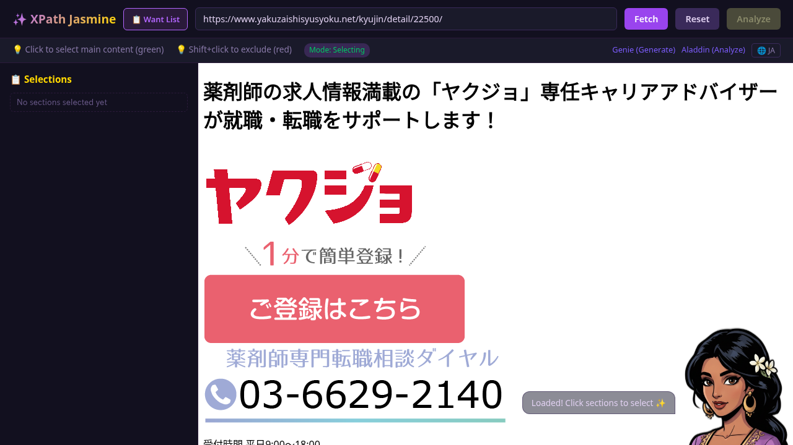
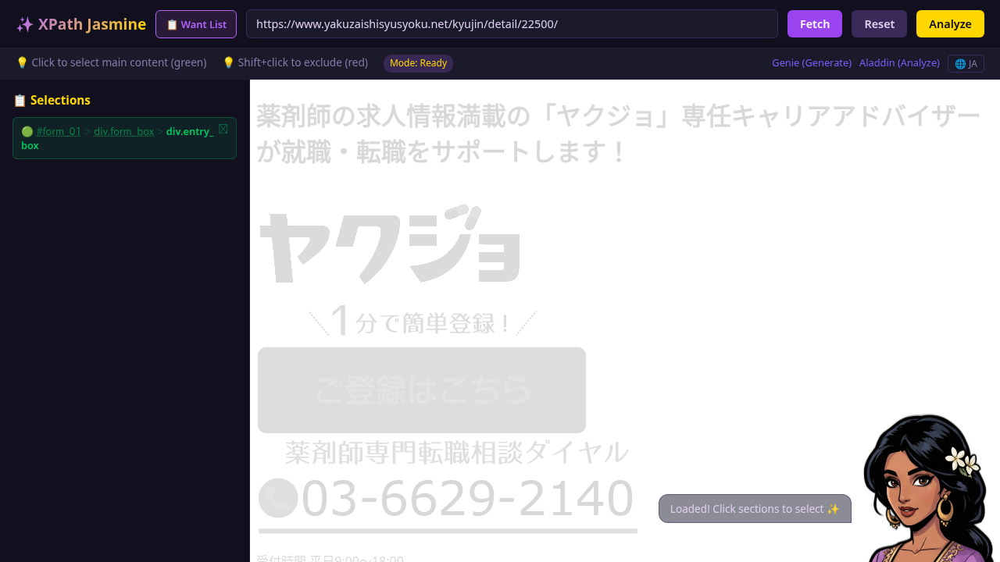
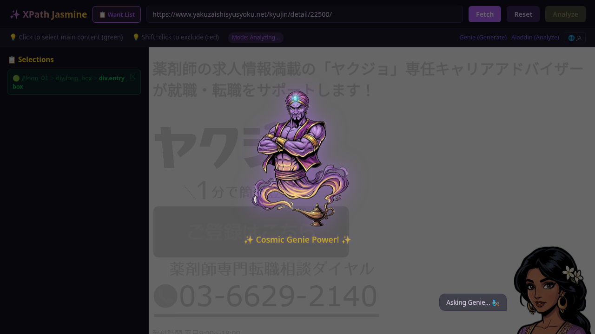
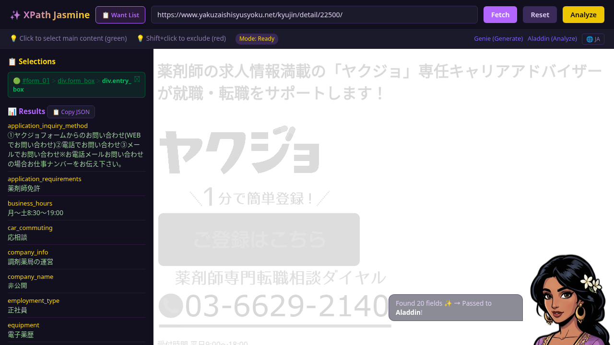
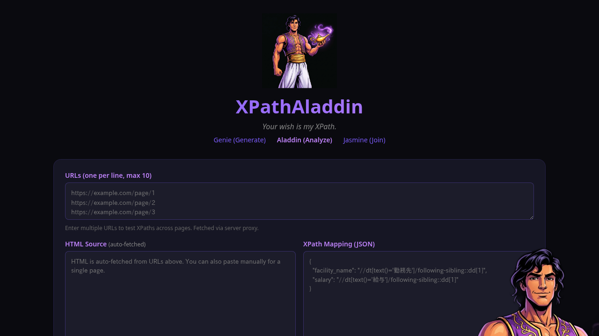
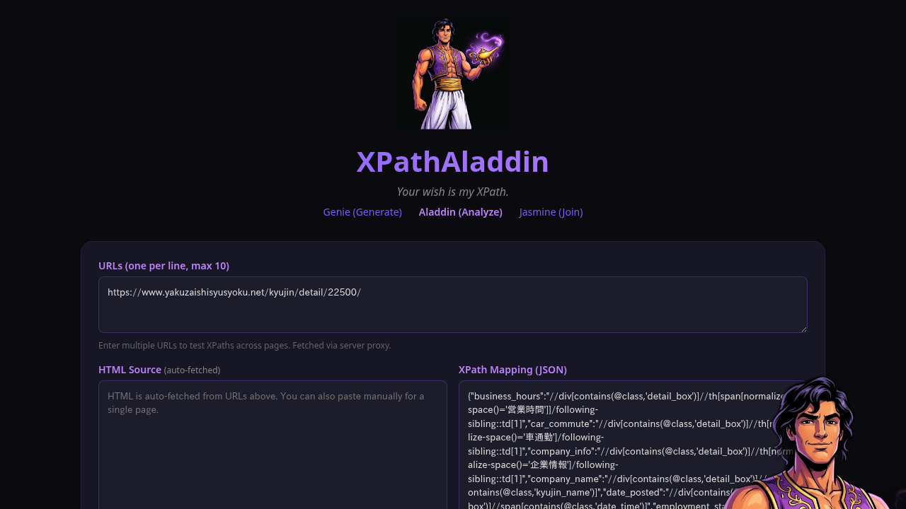

# E2E Test Report: Jasmine → Aladdin Full Flow

- **Date:** 2026-02-18
- **Target:** yakuzaishisyusyoku.net（薬剤師就職サイト）
- **Result:** ✅ ALL PASS
- **Screenshots:** images/260218/

---

## Test Steps

### Step 1: Jasmine 初期表示

- **検証:** Jasmine UIが正常にロード
- **確認項目:** URL入力欄、Fetch/Reset/Analyzeボタン、Want Listボタン、Selectionsパネル（空）、マスコット吹き出し「Enter a URL ✨」
- **結果:** ✅ PASS

### Step 2: ページFetch

- **検証:** URLを入力してFetch → ページコンテンツが表示される
- **確認項目:** yakuzaishisyusyoku.netの求人ページが正常描画、モードが「Selecting」に遷移、吹き出し「Loaded! Click sections to select ✨」
- **結果:** ✅ PASS

### Step 3: セクション選択

- **検証:** コンテンツ領域をクリックして選択
- **確認項目:** 選択パス `#form_01 > div.form_box > div.entry_box` がSelectionsパネルに表示（緑ハイライト）、モードが「Ready」に遷移
- **結果:** ✅ PASS

### Step 4: Analyze実行（Genie呼び出し）

- **検証:** Analyzeボタンクリック → Genieによる解析開始
- **確認項目:** モードが「Analyzing...」に遷移、Genieアニメーション（ランプから登場）表示、吹き出し「Asking Genie... 🧞」
- **結果:** ✅ PASS

### Step 5: 解析結果表示

- **検証:** Genieが解析完了 → 構造化データ表示
- **確認項目:**
  - Resultsパネルに20フィールドのJSON表示（Copy JSONボタン付き）
  - フィールド例: `application_inquiry_method`, `application_requirements`（薬剤師免許）, `business_hours`（月〜土 8:30-19:00）, `employment_type`（正社員）, `equipment`（電子薬歴）
  - 吹き出し「Found 20 fields ✨ → Passed to Aladdin」
- **結果:** ✅ PASS（20 fields detected）

### Step 6: Aladdin遷移

- **検証:** Aladdinリンクをクリック → Aladdin UIに遷移
- **確認項目:** Aladdin画面ロード、タブ「Aladdin (Analyze)」がアクティブ、URLs入力欄・HTML Sourceパネル・XPath Mappingパネル表示、サンプルJSONテンプレート表示
- **結果:** ✅ PASS

### Step 7: localStorage引き継ぎ確認

- **検証:** JasmineからのデータがlocalStorage経由でAladdinに引き継がれている
- **確認項目:**
  - URLs欄にテスト対象URL（`yakuzaishisyusyoku.net/kyujin/detail/22500/`）が自動入力
  - XPath Mappingパネルに20フィールド分のXPathマッピングJSON（`business_hours`, `car_commute`, `company_info`, `company_name`, `date_posted` 等）
  - Jasmine → Aladdin間のデータ受け渡しが正常動作
- **結果:** ✅ PASS（20 mappings + URL transferred）

---

## Summary

| # | Step | Status |
|---|------|--------|
| 1 | Jasmine初期表示 | ✅ PASS |
| 2 | ページFetch | ✅ PASS |
| 3 | セクション選択 | ✅ PASS |
| 4 | Analyze実行 | ✅ PASS |
| 5 | 解析結果（20 fields） | ✅ PASS |
| 6 | Aladdin遷移 | ✅ PASS |
| 7 | localStorage引き継ぎ（20 mappings + URL） | ✅ PASS |

**Total: 7/7 PASS** 🎉

## Notes
- playwright-cliによる自動実行（ヘッドレスChromium）
- 各ステップでスクリーンショットを自動取得
- セッションjsonl肥大化（18MB/140万トークン超）の問題が発生 → session-trimスキルで対処
